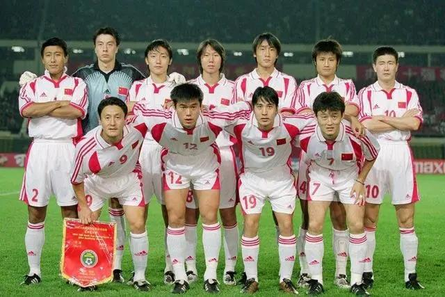
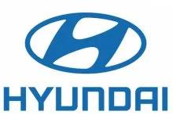
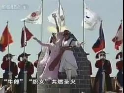

##正文

如果问中国男足的黄金一代在哪？

相信很多跟我一样的中年人，都会回忆起十多年前由郝海东、孙继海等人领衔的一支国家队，他们2002年打进世界杯决赛圈，2004年夺亚洲杯亚军，2005年夺东亚杯冠军。

 

尤其是2001年的世界杯预选赛，中国队以6胜1平1负，积19分进13球失2球的成绩，领先第二名阿联酋8分的绝对优势提前出线。

对此，有人将其归结为“黄金一代”的实力强劲，也有人将其归结为张吉龙的“上帝之手”。

以上都没有错，只不过，这些都是站在“个人的奋斗”角度去思考，而没有去考虑背后“历史的进程”。

2002世界杯上，东亚三国里面，中国首次打入世界杯，日本首次打入1/8决赛，韩国更是一路过关斩将挤进半决赛，都取得了之后几届都无法打破的好成绩。

而踩中了狗屎运的土耳其，凭借着一路先后撞上了中日韩三个“保送生”，最终也摘取了世界杯季军，这个以后也不大可能再染指的奖杯。

这能只是个人的奋斗么？

当然不是啦。

就像全球地缘政治大佬基辛格慨叹过的，国际足联的政治，宛如中东一般的复杂。

同样，中日韩三国在2002世界杯取得成绩的背后，满满的也都是交易。

那一届男足在世界杯宛如主办国一般过关斩将的背后，是中日韩的三角同盟在地下运作发挥作用。

毕竟，算一算90年代末逐步成型的“东盟10+3”这个数字，就会明白，在东南亚拥有非常大影响力的中日韩只要合力，投票时就能稳稳拉到20张票（包括大陆能够影响的中国香港、中国澳门、朝鲜，以及日本能够影响的关岛、北马、中国台北）。

而且，作为制造业强国，三个贸易顺差极强的经济体也有的是资本，对那些仰仗着我们援助的“逆差国”拉票，从而成为国际足坛内部一股非常强劲的地缘外交力量。

正是在这股“桃园の誓”般的力量支持下，亚洲人不仅从欧美控制的国际足联抢到了世界杯举办权，开创了亚洲的历史，还巧妙的一次塞进去了日韩两个种子队。

至于中国这边，自然也得到了优待，在预选赛期间，就像取经的唐僧一样，从路线的顶层设计中，避开所有强队和被做局的可能，到暗中的顺风哨加持保护，一路走来都是有惊无险。

只不过，就像韩国人不认为自己是靠裁判淘汰的意大利和西班牙那样，当年中国的球迷们只是赞许张吉龙的运气好，却不去思考为啥我们之前总是吃瘪，但这次世界杯的裁判们突然集体对中国特别好.....

嗯，正是因为很多人都把成功归结于运气，所以很多一手好牌的人，在没有看懂历史的进程之下，就把牌得稀巴烂。

譬如当年被誉为中国贝克汉姆的李明，带着几个国家队绝对主力故意给米卢找难堪，搞罢训和罢赛。他们以为没有自己了，国家队就玩不转。

结果，在中国队预选赛必须出现的历史进程之下，米卢临场抓了几个替补，却依然可以在十强赛横扫，提前锁定出现。

而这位“中国贝克汉姆”空有一副盛世美颜，丧失了去参加世界杯亮相和炒作的机会后，商业价值大幅缩水，一个足球时代的标杆就此陨落。

 

同样，帮助中国足球打入世界杯的大功臣米卢，商业广告和送的股票已经接到手软了，国家队的工资完全可以忽略不计。

可是，米卢依然摆出一副功劳都是自己的，对足协“外行指导内行”的事儿不屑一顾，甚至在出征世界杯之前擅自做主，把足协挚爱、商业价值巨大的的李明从名单里划掉了。

于是，这位创下了不世之功的大功臣，不仅承担了三战全败的责任，世界杯一结束就被卸磨杀驴，灰溜溜的被赶出了国家队。

按照历史的进程，如果米卢自己不作死继续做主教练，之后男足在亚足联的保驾护航之下，还有好几年的辉煌期，能拿不少的亚洲冠亚军，他这个主教练的商业价值将异常可怕。

搞不好现在穿着一身盔甲，带着兄弟们去攻城的不是渣渣辉、陈咬春和骨天勒，而是有着无数荣誉光环的米卢大爷了.......

 

当然，历史的进程，并不是很容易被看懂的，尤其是身在局中之人，譬如收拾了米卢的中国足协，也是把一手好牌打得稀巴烂，最后谢亚龙和南勇也一起被关了小黑屋。

 

因为，这世界上没有无缘无故的爱。

2002中日韩足球领域的大合作的背后，是中日韩地缘领域的大合作，足球不过是其中的一个载体，世界杯也不过是足球领域的合作之一。

在2002年世界杯结束之后，第二年，中日韩的A3俱乐部冠军杯以及东亚四强赛也如火如荼的开打了。

就像早年中美的乒乓外交，中日的熊猫外交，朝韩的黄牛外交那样，三国通过足球的背后，是中日韩试图推动三个相互血海深仇国家的民间往来。

 

就像杜琪峰电影《枪火》中的一个片段，一场厮杀后，几个小弟趁老大不在的时候暗中相互踢球，之前的恶劣关系在传球的过程中被慢慢的化解。

同样，对比97年亚洲金融风暴后，东亚三国之间的地下小动作，这才是那几年男足成绩强劲背后的历史进程。

嗯，还是那句话，世界上没有无缘无故的爱。

而当年三国之中，最主要的推动者，是韩国当时第一大财团，郑周永郑梦准父子。

 

现代老板郑周永是上一个时代的人，他一直想推动朝韩和解，而体育运动，就是一个很好的载体。

在这位韩国首富的推动下，2000年的悉尼奥运会上，朝韩两国运动员同举“朝鲜半岛旗”，同唱朝鲜民谣“阿里郎”入场；

 

2002年的韩国釜山亚运会上，奥运圣火更是一边从朝鲜白头山采集，另一边从韩国汉拿山采集，最后，两组圣火合二为一，象征着南北的统一。

 

甚至按照他儿子郑梦准的方案，世界杯上韩国朝鲜联合组队出征，这样，不仅能体现两国血浓于水的亲情，还能通过世界杯的成绩，激发出强烈的民族自豪感。

而作为2002世界杯筹委会负责人的郑梦准，也将凭借着这一场世界杯带来了民意狂欢，去问鼎韩国总统的宝座，彻底将金钱与权力，将现代集团与韩国政府融为一体。

所以，在这一场布局十年的韩国国家权力博弈，以及东北亚合纵连横大背景之下，这场韩国人近乎作弊式的打进大力神四强，以及对朝鲜拥有巨大影响力的中国躺着进了世界杯，均非偶然。

运动员和金钱在权力的面前，还真啥都不是.....

只不过，上到咱们的体总足协，下到教练球员，大家都高估了自己的努力在历史进程中的作用，觉得打进世界杯靠的是我们的实力加一点点的运气。

而可悲的是，正是高估了自己，也导致了全国上下都把足球的预期值调得过高，反而推动了一系列的杀鸡取卵的行为，把整个中国足球的体系搞崩了。

所以呢，虽然昨天文章委婉的批判了某位运动员，但实际上，整个中国的体育领域，普遍存在类似的问题。

大家以为取得的成功都是源于自身的努力，而忽略了在亚洲，大部分的体育运动本身就是一种国家行为。

只能说，近些年，像姚明这样会动脑子的顶级运动员，实在是太少了。

 

注：下图为主持人于嘉介绍，之前询问姚明为何放弃天价代言，去接篮协的烂摊子时，姚明令于嘉动容的回答。

 

而且，别说是运动员，哪怕是上面的官员们也很难做出正确的答案。

譬如在1993年蒙特卡洛，决定2000年奥运归属投票的时候，朝鲜跟韩国哥俩都最后时刻倒戈，导致花费了巨大代价的北京为山九仞功亏一篑。

否则，可以预想到，如果是2000年北京奥运，在老大哥的地盘上，正在热恋期的半岛两国，能在组织和宣传上玩出花来，朝鲜甚至有机会借助中国奥运在全世界亮相，寻求解除制裁。

可是，2008年年初，反华反朝的李明博上台，金刚山的一声枪响，让北京奥运夏天的会场，国际奥委会等到最后一分钟，也没等到朝韩两国联合入场.....

嗯，这就叫做历史的进程。

所以，从历史的进程来看一些事情，会觉得看很多事情就是降维打击。

就像我们回看2018年，韩国平昌冬奥会上，朝鲜跟韩国时隔十二年，又一次开幕式共同入场，还联合组建了冰球队，这本身就是一次试水。

而2020年，亚洲有东京奥运，2022年有北京冬奥以及卡塔尔世界杯，看着RCEP的推进，我们会明白，又是一轮东北亚各国暗箱交易和洗牌的良机。

因此，站在历史进程的角度来看，很多事情是可以推测的。

类似阿里复星这类的已经提前押注奥运的，就必然会在疫情中出手援助日本，而同样，就像当年的金刚山的枪声那样，必然会有些人也会成为博弈过程中的牺牲品和代价。

而看对于看懂历史进程的人来说，意义就是尽可能的踩中进程，并避免成为那个代价。

最后，回到开篇时的问题，中国足球何时能迎来黄金一代？

根据我们的体制来看，如果今年借助奥运和互访，中日关系取得历史性的突破，那么未来就可以考虑中日联合申办世界杯，届时根据韩国政局，也可以让朝韩择机联合加入，变成“三国威力加强版”的足球盛宴。

那样，就会出现时势造英雄的黄金一代......

##留言区
 无留言