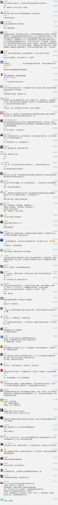

##正文

最近24小时，全球资本市场做了一场惊悚的过山车。

不仅油市创下了30%的暴跌，美股也见证了历史性的熔断，有良心的专家们不知道该写啥了，而没良心的专家们则纷纷把之前荐股的文章偷偷删除，开始高呼股灾即将来临。

结果睡了一觉，全球股指油价期货又来了一拨全面上涨。于是，刚卖完“药丸”的专家们马上转脸纷纷唱多卖“大力丸”，又开始嚷嚷着什么结构性牛市。

打打嘴炮其实没啥，那些在资本市场上加了杠杆的大佬们却悲剧了，眼睁睁的看着保证金被强平，第二天又眼睁睁的看着价格涨了回来.......

一涨一跌之间，价格没怎么变，可身家清零了....你说气人不气人？

更气人的，这次过山车的过程中，全球几个主要国家不仅动作一致，连各国期货市场也都明显出现了超级庄家，在各种重磅消息之前提前下单，用联合收割机把韭菜割的那叫一个不亦乐乎。

 

在政事堂看来，进入到2020年这云诡波橘之年，如果还拿着K线技术分析去研究资产，那么基本都是要被割的裤子都不剩的。

因为今年全球已经完全不按照资本的逻辑进行了，进入到了刚性的政治逻辑之中。

而政治的逻辑，大家可以看一下我上周的文章《疫情之下的美国股市和大选》，里面对特朗普这位操盘手近期的手段说的很明确：

>特朗普目前对股市其实不着急，疫情期间跌一跌挺好，挤一挤水分之后再拉也方便......此刻并不需要做什么去提振，防止住暴跌就好.....把屎盆子扣在桑德斯身上...

对比《降息救不了全球经济，狙击桑德斯可以？》中，民主党初选期间的先跌后涨的操作，这一轮只不过把背锅侠桑德斯换成沙特和俄罗斯，特朗普和华尔街资本都是先做空，然后再拉，剧情已经烂俗到无以复加了.....

只不过，由于国内的媒体总是喜欢给某人写去打标签，譬如特朗普不能允许股市跌，普京不能接受油价跌，于是跟着标签走，大家就手拉手一起掉坑里面了。

特朗普怕不怕股市下跌？当然怕。
普京怕不怕油价下跌？当然怕。

但是，政治家不可能去跟老百姓一样当鸵鸟，你再怎么害怕，该来的也必然会来。

就算俄罗斯跟沙特达成了减产协议，可供过于求的全球油价依然无法阻挡下跌，同样，无论特朗普怎么发推特鼓劲，全球经济引擎熄火，美国股市也必然会出现下滑。

因此，作为政治家的特朗普和普京，绝不会把下跌的锅自己背上，而是要想办法“丧事喜办”。

而这些“丧事喜办”，也都得按照各国的传统。

就像电影《斯大林格勒》中的经典片段，一群红军战士顶着浑身燃烧的汽油向德国阵地发起乌拉式的自杀冲锋，这种精神是流淌在俄国人的血液里面的。

 
[Zst_LINK_20200310_1](https://v.qq.com/x/page/d05558lr2nl.html)

所以，普京硬怼沙特，不仅打崩了全球油价，也打崩了美国资本市场，油价短期跌点算啥，这种久违的点油式冲锋只会让俄罗斯民众肾上腺激增。

而且，未来沙特必然会向俄罗斯投降，同意由沙特承担更多的减产份额，届时，在普京的铁腕外交之下，民众感受到的大国荣誉感和油价的回升，都会转化为飙升的支持率。

同样，对于特朗普所在的美国来说，民主政体的逻辑之一就是找替罪羊推给民众，这个不行就换另一个上。

懂得民众心里的特朗普，对于之前的下跌，是让桑德斯背锅，而这一轮下跌，则是让沙特跟俄罗斯背锅，

因为这个时候硬抗搞经济刺激，只会让自己替股市下跌背锅，因此，沙特和俄罗斯哥俩，顺利的接过了桑德斯的位置，变成了锅。

而特朗普只需要在暴跌之后，通过财政、货币以及贸易政策，将股市重新拉回来，那么功劳自然就都是特朗普的，刚刚遭受了恐慌的美国民众，只会对特朗普感激涕零.......

道理很简单，这不过是成语“朝三暮四”的延伸罢了，民众搞不明白先跌后涨和先涨后跌，与猴子算不清不楚早上给果子和晚上给果子，本质都是一样的，因为他们都只盯着眼前看得见的利益。

看看特朗普和普京哥俩，这才叫政治的高手，愣是把无法避免的危机，办成了自己的功劳，把全球的民众当猴子耍。

 

而接下来三个月，全球资本市场的走势，从政治的角度来看是很清晰的，特朗普跟咱们18年上半年差不多，都是在打弹性防御。

只不过，他的弹药比二战后以往历届美国总统都要充足。

第一，特朗普上台的这三年，不仅把沙特、阿联酋、卡塔尔等中东的王爷们死死的绑在了自己的战车之上，也把俄罗斯这个美国曾经无法协调的对手变成了可以暗中交易的盟友，至于全球经济发动机的中日韩三国，如今也都仰仗其鼻息，甚至全球另一个金融中心的英国，首相也换成了与其步调一致的约翰逊。

第二，在美国国内，别看特朗普与民主党撕逼撕得够呛，但是他们却有一个共同的敌人桑德斯，只要桑德斯没有被干掉，美国国内也不会爆发危机。

第三，在共和党党内，特朗普已经把共和党改造成为了川普党，美联储基本就是他家开的，货币政策几乎可以随便使用。

所以呢，从货币政策到财政政策再到贸易政策，特朗普手中有足够多的底牌，能够打多次防守反击。

可以说，除了老天爷以外，今年上半年特朗普真的没有什么能够威胁他的对手，虽然股市很可能不咋地，但是他总有事后再拉回去的办法。

所以呢，那些试图鼓吹股灾末日的专家们，也别把牛皮吹得太足，今年二季度是没啥机会的。

毕竟，特朗普手里握着一张点数足够大的中国牌，在酝酿出这张牌之前，全球资本市场很难出现真正的危机。

##留言区
 

