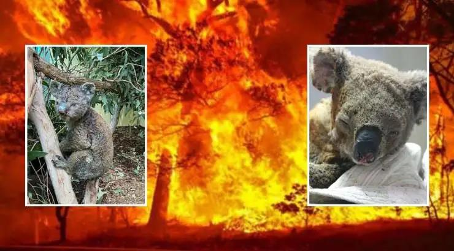
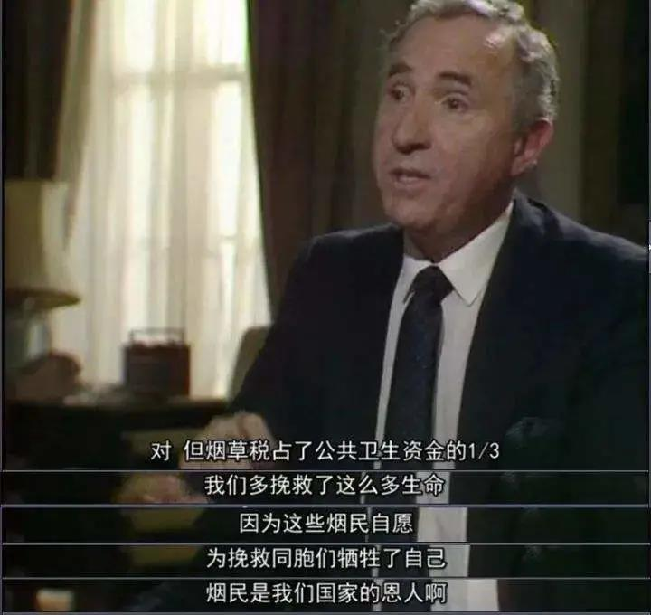
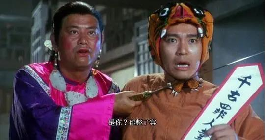

##正文

最近，国内几乎所有的财经媒体，都把全球资本市场的震荡下行，归结于病毒的泛滥，习惯了做K线的分析员们，也纷纷试图将病例数据化跟指数建立联系。

这种主动“揽锅”的行为，看得政事堂头都大了。

首先，就是不专业。

病毒扩散本身，跟指数的下跌之间，并不是正相关性的，而是负相关性的，或者说单纯从账面分析，病毒是有利于经济的。

大家还记得前段时间的澳大利亚森林大火么？

 

虽然野生动物烧死了不计其数，但是一些“理智的媒体”却纷纷跳出来科普，告诉大家大火对生态系统长远来看是有益的，慢慢的，这个观点也赢得了广泛的赞同。

嗯，这个观点自然是符合逻辑的，按照《老子》“天地不仁以万物为刍狗”的观点，人类作为自然界的统治者，的确没有必要花费巨大的代价，去挽救一些“春风吹又生”的动植物。

但同样的逻辑换个角度，把火看做病毒，把森林里的动物看做病人，那么统治阶级也很容易通过计算，得出“病毒是对生态系统进行的一次修正，长远来看有益”的判断。

嗯，当年希特勒就是这么干的，当年把犹太人当“动植物”的欧洲人，后来也因此饱尝苦果。

所以，看着最近的新闻，美国高企的致死率，以及去检验病毒需要支付数千美元的账单，就会明白如今的西方统治阶级，还是把病毒当做一个生意。

对此，英剧《是的，首相》有过经典的解释，政府对烟草生意放纵的背后，是因为其不仅“生的时候”为政府提供了巨额的公共资金，“死的时候”也为政府节约了大量的养老金支出。

 

同理，在资本主义是由生产力和生产资料构成的，那些容易被病毒感染的人，主要是丧失生产力的老年人，那些治不起病的人，往往都是没有生产资料的穷人。

对于能把账算到骨子里的资本家们来说，一场流行的病毒，把既没有生产力又没有生产资料的群体从地球上抹去，那股市不但不应该跌，反而应该涨。

这账你算得害不害怕？

因此，我们还真没有必要去嘲笑那些对病毒“不设防”的西方国家，人家的精英层的不作为，并非是因为他们不懂“抄作业”，反而是因为他们“太懂了”。

他们不怕病毒，但是怕恐慌，恐慌会导致运行中的生产关系被迫中断，生产力和生产资料也就瞬间熄火丧失价值，会带来经济的崩溃。

所以，无论是研究经济，还是研究时政，我们都要明白一个底层逻辑，真正影响资本市场的不是病毒，而是病毒引发的恐慌。

因此，越是西方国家，越是资本市场成熟的国家，越是会极力遮掩疫情，这也是为什么“后爆发”的美国和意大利，致死率却远远高于东方的中日韩。

不要觉得奇怪，只要学了西方经济学就会明白，大火蔓延不救动植物，病毒泛滥不救穷人，这都是资本的必然选择，跟西方每次股灾和房价崩塌的时候不救韭菜，逻辑上都是一致的。

毕竟，在资本面前，大家都是韭菜，野火烧不尽，吹风吹又生。

 

而且，资本家们通过选举制度在台上搞了一批的代理人，让他们去为政策背锅，一旦民众愤怒了，大不了换一批就好，就像俗话说的，“自己投的票，含着泪也要........”

至于在东方国家，在救灾防疫方面往往要承担无限连带责任的政府，负责官员容易更严厉的处分甚至逼着切腹自杀。

没办法，虽然东西方文化不尽相同，处理方式也有区别，但有一个逻辑是一致的，那就是找一个背锅侠。

 

没办法，这是人的天性，几乎所有的韭菜，对于任何自身受损的事件，都不愿意承认是自己的问题，也不愿意找自己的问题，而是想把责任推出去。

就像政事堂最近三年，每年都会吹几次冲锋号和撤退号，而随着政事堂的成长，每次的精度范围也都在不断的缩小。今年年初，不仅给出了入场时间和标的，连撤退的时间，也根据韭菜和镰刀给了两份时间表，一个是“2月20号左右的护盘结束，走人”，一个是“新基建小阳春最迟五月也结束了，3月卖”。

可却有数不清的读者，把他们看到的“3月卖”和“最迟五月”，硬是解读成了“三月底卖”和“五月底卖”......甚至昨天文章发完，还有不少人问是不是可以买入美股了.....

其实，这些读我文章的人，不过在给自己的贪婪投机行为壮胆，并寻找一个投机失败时可以甩锅的背锅侠。

没办法，这就是无法改变的人性。

既然改变不了，就得趋利避害，不能接这个锅。

就像近期的美股下跌，一贯自诩跟美股捆绑的特朗普，也找了桑德斯和沙特俄罗斯等几个接锅人。

因为“没有人比我更懂人性.JPG”的特朗普，他比所有人都清楚，一旦民众把股市下跌的锅甩给总统，那么资产损失的巨大愤怒，足以将他前三年的功劳一次性全部抹杀，引发的竞选失败，也可能让自己陷入身死族灭的境地。

同样，我们的情况也不容乐观。

目前，西方掌权的资本家们的重点，不是遏制病毒，而是遏制病毒引发的恐慌。

所以，近期他们会想尽一切办法遮盖和延缓问题的爆发，因此我们现阶段承受的舆论压力还比较轻。

可是，掩盖必然是盖不住的，他们只是在给自己争取时间。

就像这几天，全球资本市场的震荡，大量韭菜被资本反复收割的不断重演，再加上疫情限制的人身自由，用不了多久，就会使得西方政府和资本家们进入一个新的阶段。

那就面对民众的愤怒，为自己的不作为寻找背锅侠。

所以呢，国内的媒体们，别再千方百计去争当背锅侠，也别沾沾自喜的以为会带动避险资本流入，这一股足以掀翻特朗普的愤怒，一旦指向了我们，也能轻松把我们碾成粉末。

政事堂最近看着特朗普在费尽心力的帮我们转移矛盾，把股市下跌的锅甩给桑德斯、沙特和俄罗斯，而国内的媒体们却在纷纷花式争抢接锅，破坏特朗普为我们苦心经营的国际舆论环境........

不得不慨叹，究竟谁才是我们的“同志”。

 

##留言区
 

