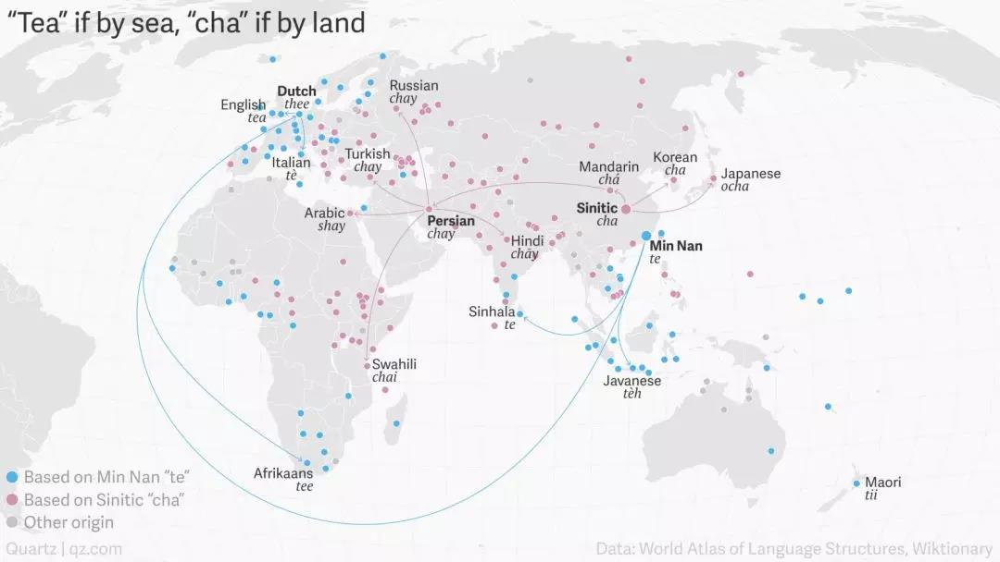
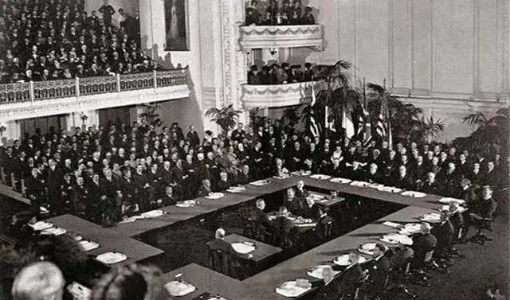
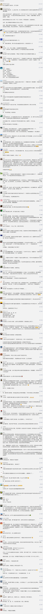

##正文

同一个事物，不同人往往会有不同的解释。

譬如中国的茶叶，在全球就有两组发音。

一部分人称茶叶为tea，譬如英语“tea”法语“thé”德语“tee”西班牙语“té”意大利语“tè“”丹麦语“te”以及荷语“thee”。

而另一部分人则称之为cha，譬如葡萄牙语“chá”，捷克语“čaj”，罗马尼亚语“ceai”，以及俄语、波斯语、阿拉伯语国家和南亚大陆地区，基本也都采用cha的发音。

一词两发音，背后其实还真不复杂。

 

就像大侦探Holmes被“h、f不分”的福建人引入后，硬是翻译成了“福尔摩斯”，形成了中国人的惯例那样。

在福建，茶叶也被读成tui和tey。

因此，当年那些听信了福建小妹的外国茶商，也会跟着把茶读成tea，回去教育本国人民。

传播途径的不同，也就使得全球对茶的发音泾渭分明。

早年通过古丝绸之路跟中国做贸易的，基本都是按照长安秦腔“cha”的发音，而随着宋明海上贸易的兴起，之后跟中国做贸易的国家，基本都是按照海上丝绸之路起点，福建泉州的“tey”发音。

 

唯一特例的葡萄牙人，在茶这个字上没有被福建口音带歪，很可能是因为他们在中国的贸易中转站不在福建，而在广东的澳门........

这种例子其实并不少见。

就像中国人餐桌上的荷兰豆，英国人却称之为中国豆（Chinese snow pea），其实，这个豆子既不是荷兰人也不是中国人培育的，而是生于中南半岛。

可是，认为中南半岛是中国势力范围的英国人，自然只会称之为中国豆，而看到是荷兰人把豆子运过来的中国人，自然也只会称之为荷兰豆。

对于人类，第一印象总会占据非常重要的位置。

就像每天下午都要喝茶的英国绅士们不会去研究茶的中文发音那样，我们也不会在乎荷兰豆、荷兰猪甚至荷兰弟是不是源自荷兰......慢慢的就会养成习惯，不会再去较真。

毕竟，荷兰猪连猪都不是，还有谁会在乎这货是不是来源于荷兰。

 

而这种语境，会延续很久。

譬如，从丝绸之路传过来的物件，我们叫胡琴、胡床、胡瓜叫了上千年，后来西洋传来的洋火、洋伞、洋车、洋房，我们也叫了上百年。

因为第一印象一旦被民众广为接受，就很难再被修改，将成功注入到民众的潜意识当中。

而其中最经典的例子，就是“西班牙大流感”。

这场1918年秋季爆发的全球流感，导致了全球约10亿人感染，5000万以上的人口因此丧命，可以说是近代人类最惨痛的一次教训了，连同时爆发的一战都没死那么多人。

可是这口锅，就被无辜的西班牙人永远背上了。

因为当时正值第一次世界大战，从欧洲到亚洲，所有的主权国家几乎全部参战，只有西班牙等几个国家在全程打酱油。

当时虽然流感在欧洲已经泛滥成灾，但是新闻管制的欧洲各交战国，都一致选择了对民众瞒报，以避免出现战场上的一溃千里。

而逃过了一战的西班牙，因为有余力处置以及大量宅在家里的吃瓜群众，还有非战时无新闻管制，反而成为了全球舆论的焦点。

于是，为了对瞒报疫情甩锅的各国政府，纷纷把将这场流感命名为西班牙大流感。

一肚子委屈西班牙人自然不会背这个锅，随即就甩给了邻居法国，称之为法国大流感。

而法国此时正在西线跟德国人死磕，不想被西班牙人背刺，因此媒体就纷纷把锅甩给了赴欧洲参战的中国劳工，开始炒作中国人吃野生动物。

这画面是不是有点熟悉呢？

实际上，这场流感的泛滥，最早是爆发在美国堪萨斯州的一个军营之内，但当时，整个欧洲都不敢去捅破这层窗户纸。

这是因为1918年，一战已经进入到了最后阶段，美国的军火和援军，是决定战争什么时候结束，以及战后如何瓜分胜利果实的关键，没有谁会在这个关键时刻去惹美国。

因此，直到一战结束，巴黎和谈开始，大家开始坐下来分蛋糕了，美国率先爆发流感的新闻，才开始被偷偷曝出。

而此时，作为一战战胜国的中国，反而因为这场美国率先引爆的西班牙大流感躺枪了。

一方面，巴黎方面早先就宣传华裔劳工传播了流感，导致中国几十万劳工做出的牺牲被西方普遍无视。

另一方面，英法等老牌帝国主义国家，也借机玩起了大变脸，拒绝了之前秘密允诺美国的众多条款，并迫使美国在和谈期间不断让步。

最终，中美两国舆论场上的劣势，使得美国对华的承诺无法兑现，导致中国在巴黎和会上遭遇了惨败，明明是个战胜国，谈下来差点变成了战败国。
 
 

以史为鉴，可以知兴替。

可以预见的是，如今的新一轮西班牙大流感必然也将引发一场全球的震荡。

看着最近各国新闻的虚虚实实，就会明白，全球的政治家们早就已经开始了纵横捭阖。

而对于我们来说，想要在接下来的“新巴黎和会”上，能够分蛋糕而不是被割肉，不仅需要马爸爸们冲在全面纵横捭阖，就像昨天文章中说的，媒体也要少犯错，不能给对手送弹药。

而更重要的，则是科研方面查好病毒的族谱和来源，为了接下来我们的大交易，准备好足够重磅的手牌。

##留言区
 

