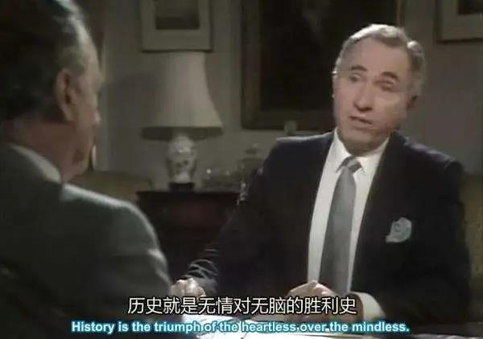
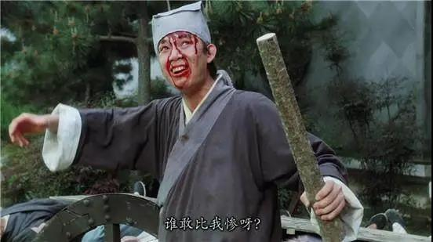

##正文

今天凌晨，特朗普以宣布“国家紧急状态”，带着美股又打了一场绝地反击，三大股指均创下08金融危机以来的最大涨幅。

这一周连续的过山车，也令无数吃瓜群众和做空者都被吓得瞋目结舌。

而更令吃瓜群众们无法淡定的是，就在全球主要国家均开始强力围剿病毒之际，英国首相约翰逊却宣布，英国进入应对疫情的第二阶段——“延缓”病毒传播，当下还不会实施学校停课、员工在家办公、取消聚会活动等相关措施。

 

对此，英国首席科学顾问瓦伦斯在解释说，目前制定的政策是让民众尝试创造免疫力，将新冠状病毒转为“年度性的病毒”，预计英国将有60%的人口（4000万人）感染新型冠状病毒。

主动感染病毒？

这让很多中国吃瓜群众看到这则新闻，旋即就不淡定了，于是，批评英国的舆论瞬间铺天盖地。

连世卫组织发言人接受央视专访时强调，任何国家都不能把“无力回天”当借口，自暴自弃。

 

但政事堂看来，我们真没必要替英国人操心。

首先，英国政府的选择，是他们经过了精密计算之后的必然选择。

 

其次，也不要觉得英国老百姓被忽悠了，作为民主政治的发源地，跟英国人讨论民主政治，就像跟北京司机讨论一样，你会被教育的怀疑人生。

 

英国的奇葩，其实并不奇葩，大家可以看一下最近几个相似的新闻。

从最早新加坡政府著名的“佛系抗疫”，到最近孙正义给日本政府捐助100万份试剂盒，被日本民众骂了一个狗血喷头，都快成了卖国贼了。

这一幕幕令中国吃瓜群众目瞪口呆的背后，实际上是全球三大发达“岛国”，在对抗新冠病毒面前，都不约而同的选择“躺着等死”。

 

所以呢，三个全球最富裕的岛国，连人家最低收入的群体，都吊打国内的键盘侠们，我们还真没有必要去调侃人家。

其实，从疫情爆发之初，有过逻辑学训练的朋友就很容易明白，全球都陷入到了囚徒博弈之中。（名词就不解释了，自行百度搜索）

理论上，大家跟中国一样，选择硬抗，是全球集体的最优解。

但是实践中，这场博弈中，全球上百个国家，只要有一个国家不死扛，那么其他国家的最优解，就是也不死扛。

否则接下来源源不断的输入性病例，会把这些国家从精神到肉体活活拖垮。

尤其是那些无法做到硬抗到底的国家，前面的硬抗，都会变成白白付出的代价。

所以，越是“聪明”的国家，在计算过其他国家的选择后，越会选择提早投降，而降低对本国国力的摧残。

 

因此，新加坡日本英国这些海洋岛国先后提前高举白旗的背后，本质是统治阶级经过一系列概率和成本测算之后，选择的一个最优解。

所以，骂和调侃都没啥意义。

对于我们来说，几个海洋国家的一致坐以待毙，推导出一个比较确定的结论，那就是远比我们掌握更多信息的统治阶级认为，这一波病毒的全球散播已经无法避免。

只有在这个确定性之下，他们的动作才是合理的。

而此时，欧美大陆的几个主要经济体，他们目前的策略，已经暴露无遗，那就是“错峰上下班”，他们早就放弃了中国这样把病毒围歼的想法，而是像特朗普对资本市场一样，搞弹性防御，避免短期内的集中恐慌导致医疗体系崩溃。

因此，在这一场囚徒博弈中，根据大陆国家的策略，海洋国家则更会制定对他们更有利的策略。

一方面，这仨海洋国家有一个共同点，那就是大陆的离岸中心，他们不可能去封锁他们财富来源的大陆。

另一方面，这些海洋国家也清一色都是老龄化极其严重的国家，再加上老年人掌握的财富，使得这些国家的决策也会偏重于老年人。

所以，他们索性就直接装作没事儿人躺着了。

由于老龄化严重，英日俩海洋国家冬天都是医疗体系最紧张的时期，如果在冬季爆发新冠病毒，那么医疗挤兑造成的死亡人数，至少是新冠数字后面加一个零。

因此，在对新冠病毒死亡率和经济的损伤经过计算之后，这些国家的政府在面对新冠病毒和医疗崩溃之间，很容易就会做出他们的抉择。

而被日本人骂成“日奸”的孙正义，就是没有算明白这个账，没有领会好日本政府的意图。

 

对于政事堂来说，不愿意自以为多高明的加入到抨击英国日本以赚取流量的事儿，而是希望能够从一些新闻中，寻找到历史进程中的一些必然发生的事情。

譬如从近日美国确诊人数的激增而不去掩盖，到跟美国有着特殊关系的英国也选择“躺着等死”，这里面实际上可以得出一个结论。

那就是之前被全球给予厚望的美国特效药remdesivir ( 人民的希望） ，已经不被英美统治阶级给予厚望了，九成概率也就是个“双黄连”。

接下来，英美从舆论到资本市场，都要想尽办法让民众消除恐慌，消除波峰带来的冲击，避免从资本市场到医疗体系的冲击。

反之，既然全球扩散在西方统治阶级眼中无法避免，还还需要想尽办法让民众消除恐慌。

这也意味着，中药必然会在这一波病毒中发挥威力，成为中国“新巴黎和会”谈判桌上面重要的筹码，也将带动整个行业，赶上一波历史的进程。

##留言区
 无留言