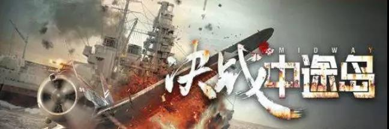
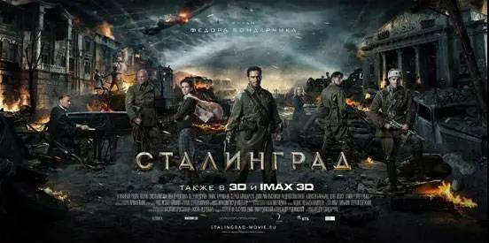
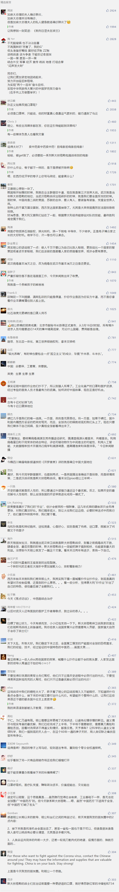

##正文

1941年12月2日，重庆，国民政府机要室。

一直负责监听日本的情报人员截获了一份绝密电报，五天后，日本海军将对夏威夷美军发动突袭。

国民政府一刻也不敢耽搁，同时通过外交渠道速送给驻重庆的美国大使高斯，并电令我驻华盛顿武官郭德权直接联系美国军方。

历史往往有着惊人的相似，坐等着的美政府和美军并没有珍惜中国争取的五天时间，1941年12月7日清晨，日本海军突袭美国太平洋舰队在夏威夷基地珍珠港，太平洋战争爆发。

 

由于八路军在抗战后与国民政府共享了日军密码本，早在41年5月，国民政府就已经知道了日本在反复查询并收集珍珠港内停泊舰船的情报。

甚至，日本外务省反复电文确认哪一天珍珠港停泊的舰船最多，也让国军上下都猜到了日本会选择礼拜天这个攻击的时间点......

而情报能力吊打日本的美军更不用说了。

他们不仅在袭击前调走了港内的航母，只在港内留了几个老式战列舰，还把主力战斗机临时调走，把机库里面的旧战斗机整整齐齐的摆在跑道上。

一整套迷踪拳，让精心计算消灭美国有生力量的日本扑了个空。

而几个月后，当全球各国在纳粹的共同威胁之下签署“大西洋宪章”后，那些在珍珠港成功逃逸的航母和飞机，就在中途岛完成了完美的复仇，成功给日本海军送终。

 

不要觉得珍珠港的美军士兵们冤枉，他们只不过是历史进程中必然付出的代价。

因为经过一系列的计算，让日本空袭珍珠港，是美国损失最小的选择，而且，在“虎虎虎”突袭之前，美军也临时调派了大量的医药物资和医护人员，还能进一步降低阵亡率。

不要觉得残酷，这是极端冷静计算之后的必然选择。

所以，读懂了历史，就会对近期英美各国政府的骚操作了然于胸，中国这一次为他们争取的宝贵时间，人家同样也不重视的。

因为各国统治阶级经过精密的计算之后，早就得出了最有利于他们的方案。

就像二战时面对纳粹德国的攻击，法国人决定“躺下装死”，英国人选择“隔岸观火”，事后来看，还真是他们各自有限条件下的最优解，选择跟小胡子硬拼只会让自己的元气消耗殆尽。

更有甚者，二战时期法国的投降和英国的绥靖，不仅是两国政府的选择，同样也是两国民众的选择，这种做法，对于国家、政党和民众来说，是三赢的选择。

所以，这里政事堂再次提醒，我们无论官方还是民间，千万不要去海外瞎鼓吹什么“抄作业”，这种做法会给国家造成巨大的伤害。

要知道，这些资本主义国家一百年前就不存在“乌拉式”冲锋的民意基础，也不具备强大的基层组织能力，强行抄作业只会导致“机毁人亡”，各方一起惨败，结果就是对我们口诛笔伐。

对比武汉就会明白，刚封城的时候，主流舆论都在一边倒的吹哨子，结果就是短期内引爆了武汉医疗挤兑，造成了巨大的牺牲。

对比捐测试剂的孙正义都成日本民众骂成了“天诛国贼”，也就会明白，**我们坚决不能去鼓吹“抄作业”，我们坚决不能去鼓吹“抄作业”，我们坚决不能去鼓吹“抄作业”。**

**重要的事情说三遍，千万不能这么搞，否则吹逼一时爽，全家火葬场，我们会站在全球的对立面上，遭到50亿人口的围攻。**

说起来，政事堂是知道老百姓喜欢看什么，知道怎么能写出来爆款的。

在武汉疫情得到控制之前，主流舆论是“吹哨”和散播谣言恐慌，而武汉得到控制之后，主流舆论变成俩极端，要么是“认错”，要么是“自吹自擂抄作业”。

的确，这么写会让读者很爽，但是结果却往往很坑爹，因为做对的事情和资本市场的投资一样，往往都是反人性的。

而我们目前的重点，就是尽可能的手握更多筹码，以降低疫情带来的损失。

就像昨天文章说的，对比二战，如今我们作为全球能够组织起乌拉式冲锋的国家，在其他国家都选择绥靖之际，必然要承受主要冲击。

所以，我们必然也就要获取相应的补偿。

不要觉得国家出钱封锁和治疗跟你没关系，我们所有的防疫措施，花的都是14亿纳税人的钱。

而这也是政事堂近期文章主要集中在宣传，以及背锅与甩锅的问题，甚至昨天文章还提了一下传统的医药。

道理很简单，接下来的重点是交易。

就像二战时期，苏联和中国分别承担着抵抗纳粹主力部队的重任，付出了巨大的代价，而离岸的英美，则通过北极航道和滇缅公路向苏联和中国运送物资，这本就是我们付出巨大牺牲的一种交换。

而这一轮全球面对疫情，西方主要发达国家已经很显然要再一次走绥靖路线了，那么我们作为唯一跟病毒死扛的国家，近期宣传的重点，绝不是我们的战术多么成功，而是我们在全球防疫中付出的巨大代价。

这件事情我们没必要打肿脸充胖子，苏联钢铁洪流一路逆推到柏林，靠的就是英美北极航线源源不断的援助。

而远期，我们的重点，则是吹响对病毒反攻的号角。

九省通衢的武汉，就是二战的斯大林格勒，是一座英雄的城市，病毒在武汉基本消灭之日，就是这一场全球围剿病毒战役的转折点。

 

未来，随着欧洲各国的躺着等死，将病毒驱逐出境的中国白衣战士们，以及钢铁洪流一般的医护用品，也将担负起从病毒手中解放“欧洲”的重任。

当然，交易的本质，是看各自手握的筹码。

看着马云一边全球捐口罩，联合国一边推荐阿里钉钉，这不过是缩影。

我们所有在科研、医药领域取得的成就，我们医疗队的远征，都将是新的“巴黎和会”、“雅尔塔会议”上，我们跟其他列强在桌子上交易的筹码。

 

而且，最关键的是，资本主义在算计的时候只会算自己，导致二战之后，英法的全球殖民地分崩离析。

同样，这一轮病毒冲击下，全球最严重的必然是医疗体系脆弱的第三世界国家，而随着发达国家们对病毒的绥靖，一场全球地缘的大震荡，也许就在我们的眼前。

chaos is a ladder，就看怎么把握了。

##留言区
 

