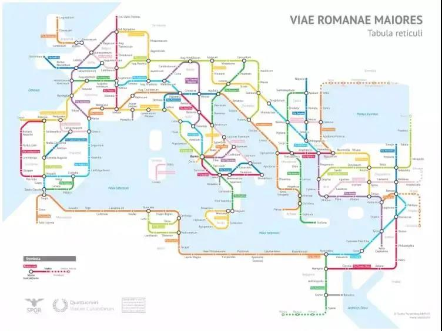
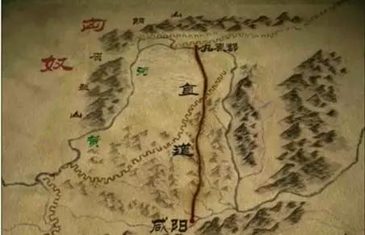
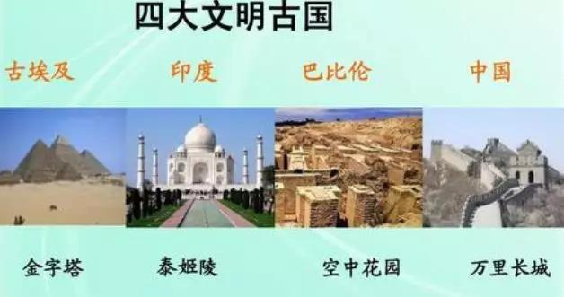
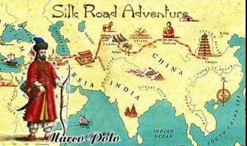
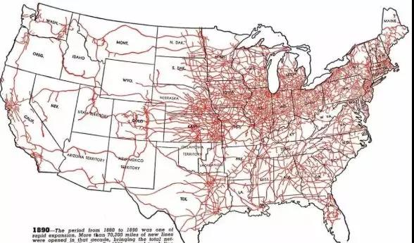
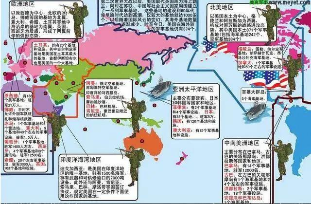
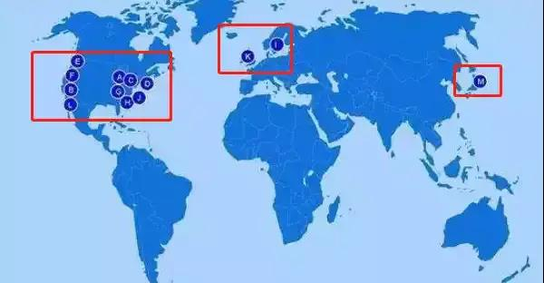
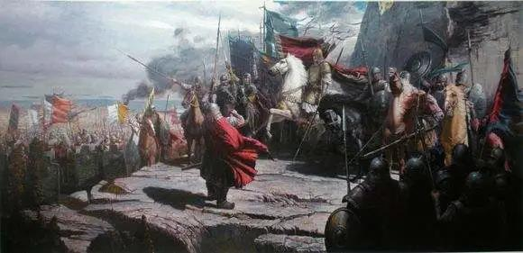
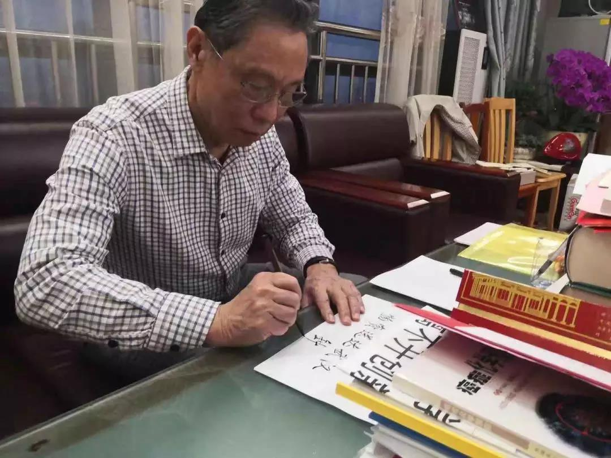
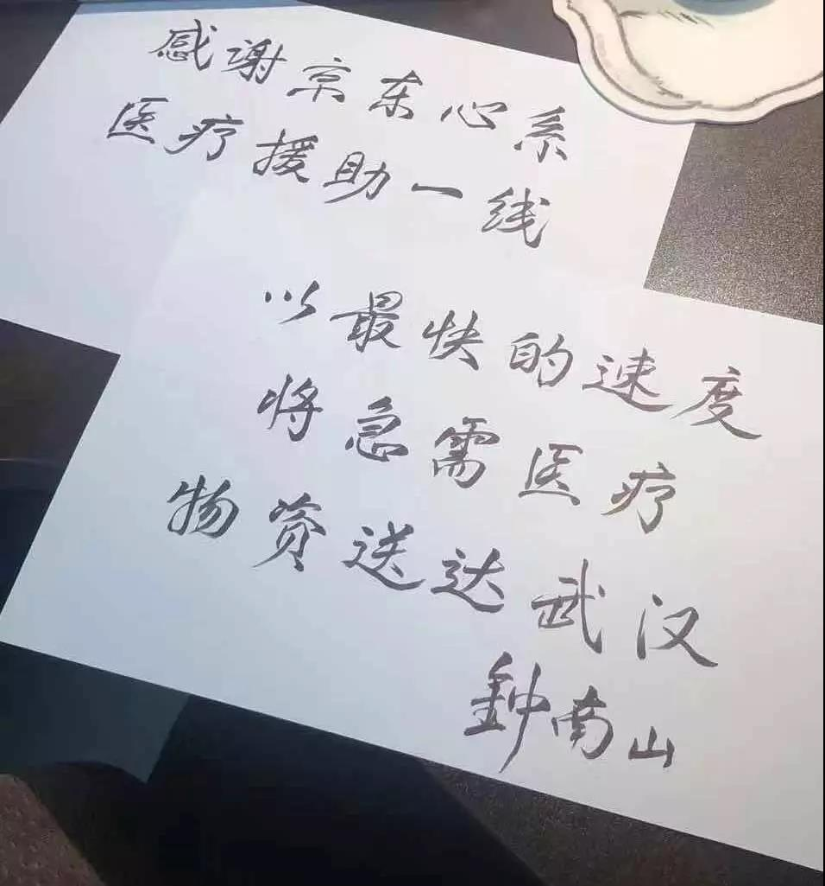

##正文

一代人有一代人的使命，一代人有一代人的担当，一代人有一代人的新基建。

最近。随着中央多次强调新基建建设，从散户到媒体到券商，全国开启了一片新基建热潮，一个产业如果不能跟新基建挂边，出门都不好意思跟朋友打招呼。

但伴随着新基建热潮，也涌现出一群“以假乱真、鱼目混珠”的假基建。

如何判断一个项目是不是“新基建”呢？

其实，有一个比较朴素的办法：

国家支持的基建，短期内不以赚钱为目的的基建，才是新基建。

不要觉得新基建的逻辑有多高深，早在两千多年前，从凯撒到屋大维，从秦皇到汉武，亚欧大陆的两侧，就不约而同开始了一场“新基建”竞赛。

 

公元前3世纪，随着罗马统一亚平宁半岛，一场欧洲史无前例的基建狂潮开启了，地球赤道周长才4万公里，罗马人却围绕首都修了超过40万公里的高标准道路。

密布的道路仿佛后世的地铁线路，以至于从欧洲任何一条大道开始，最终都能抵达罗马，也诞生了那句著名谚语，“条条大路通罗马”。

 

道路基建不仅联通了各个城市，也把城市都通向了港口，将地中海变成了罗马的内海，将亚平宁、伊比利亚、巴尔干、亚细亚、埃及、北非，这些原本被丛山峻岭戈壁海洋阻隔的地域连到了一起，商贸的往来极大的促进了经济的发展，使得罗马成为了欧洲工业革命之前最富庶的时代。

 

而与罗马同期的秦朝，不约而同也开启基建狂潮，不仅修长城修运河，还修建了中国最早的国道，《汉书》中记载，“秦为驰道于天下，东穷燕齐，南极吴楚，江湖之上，滨海之观毕至”。

也可以说是东方版的“条条大道通咸阳”。

 

无论罗马还是强秦，东西隔绝的两个国家，在修路的时候都是不计成本，“国道”不仅使用了硬石铺路，道路两旁也种满了遮阳固土用的树木。

至于道路质量就更不用说了，秦朝样板路的秦直道，跨越了两千年一直用到清朝；而二战末期的盟军坦克，也是压着两千多年前修的石制硬路面开进罗马。

大秦和罗马不计成本的疯狂基建背后，是沿着罗马的大道，凯撒和屋大维可以第一时间派出罗马兵团横扫欧洲，令各地的蛮族望风而降。

同样，沿着秦直道，大秦铁骑最快三天就可从关中直抵云中，这才有了强秦“却匈奴七百余里，使胡人不得南下而牧马”，大汉的“封狼居胥”和“不教胡马度阴山”。

 

嗯，这就是两千年前的“新基建”。

凭借着靠着强大的基建，罗马维系着欧洲的大一统；依靠着基建延伸的力量，两汉的四百年间也形成了华夏民族和命运共同体。

不要以为华夏命运共同体的领土都是充话费送的，那都是我们祖辈们愚公移山般一步一步修基建修过去的。

在秦皇汉武的带领下，在北方，我们修建了万里长城，打通了太行山，将河套收归汉土；在南方，我们修建了灵渠，打通了长江和珠江，将两广纳入版图；在西南，我们五丁开山打通了蜀道，将川渝变成了我们的粮仓；在西北，我们打通了丝绸之路，将西域纳入了我们的怀抱。

 

而且，不仅仅是大一统的秦汉，华夏民族自诞生以来，就在通过大基建“鬼斧神工”打造命运共同体。

隋炀帝修建的大运河打通了南北，结束了自东晋以来中国数百年的南北分裂。

明太祖修建了几十万公里的驿路，向北一路修到了松花江，向西一路修到了拉萨，将远东和西藏收归中国的版图。

 

不要奇怪，修基建是刻在中国人的基因和血液里面的。

而正是因为我们对基建的不断创新，才让中国人延续至今，不像修金字塔的古埃及人，修空中花园的古巴比伦人，修石窟的古印度人，都只能停留在历史的长河中。

 

就像先圣孔子说的，有朋自远方来，不亦乐乎。

正是因为中国人不断大规模推动“新基建”，加入到华夏命运共同体的族群就越来越多。

而随着不同地域文明交流和商贸往来，以及度量衡的统一，生产效率一直高速增长，这也使得在工业革命之前，东方累积了令欧洲人为之垂涎不已的财富。

 

而此时的西方，罗马已经覆灭了数百年，欧洲陷入到了漫长而黑暗的中世纪，经济与文化也长期停滞。

直到哥伦布的发现了新大陆，横跨大西洋的海运成为了连接欧美非三块大陆的“新基建”，西方文明才迎来了春天。

其实，无论是东方还是西方，做基础设施建设的原理都很简单，就是要将原本割裂的人群联合到一起，形成命运的共同体，共同发展迎接新的未来。

做一个总结，就是一代人有一代人的使命，一代人有一代人的担当，一代人有一代人的新基建。

**中国自大一统以来，能够创造一个又一个辉煌盛世的背后，不是重复去搞旧基建，而是不断的开创新基建。**

两汉兴盛的背后，是秦皇汉武不惜成本的基建，以关中为中心修路，将山东和西域通过经贸横向连接在一起。

唐宋兴盛的背后，是隋炀帝唐太宗不惜成本开凿的大运河基建，建立了中国南北之间的贸易流转体系。

明清中国商品经济的空前繁荣，靠的是明太祖明成祖把驿路修到了内陆偏远地区，使得商品贸易不再局限于几个主要城市，而是可以沿着道路的毛细血管行销全国。

新基建的商业逻辑其实很简单，根据兰彻斯特方程，人口的汇聚与联通，会带动贸易规模以二次方的规模增长。大规模的基建，将更多的人口和商品纳入体系，任何的发明和商品都可以迅速销售，工商业和经济自然就会取得蓬勃的发展。

而且，不要觉得基建是近代中国人的独家手艺，近代美国能够从殖民地一步步走向全球霸主，成为新一代的罗马，也是靠着一代一代不断推动新基建。

从美国取得独立之后开始，他们就疯狂的在美洲大陆上修建铁路网，彻底将美国独立的各个州融为一体。

 

等铁路已经过剩之后，美国开启了海洋新基建计划。

先后在全球修建了两百多个海军基地，控制着直布罗陀、苏伊士、巴拿马、马六甲、日本海峡、波斯湾等全球所有的海上交通枢纽，商品行销全球的美国迅速成为全球最强的国家。

 

之后，冷战开启，美国又推动大规模建设的马歇尔计划，伴随着对欧洲的援助，美国的商品得以源源不断的进入欧洲，带动了美国战后的高速繁荣。

而随着击败了苏联结束冷战，第二年美国就启动了“新基建”的信息高速公路计划，通过互联网将世界各国都纳入到了美国的全球化体系，美国的科技服务公司，从微软到谷歌，从亚马逊到苹果，无数的美国企业都借助着这条高速公路之上在全球攻城略地。

甚至也可以说，位于美国的IPV4互联网根服务器与子服务器，与全球各国互联网的树状链接，就是继铁路新基建、航运的大基建plus，“条条大路通罗马”的新时代翻版。

 

历史不会重演，但总会惊人的相似。

而太平洋的另一端，随着东方乱世的终结，新中国能够从半殖民地半封建的农业国，用了一个甲子六十年成为全球第二大经济体，靠的也是中国人民一代又一代的新基建，开启一次又一次的新长征。

从建国初期全国的铁路管网，到改革开放后的遍布全国的国道建设，再到新千年之后的高铁以及全球领先的4G网络，每一次我们开启一轮新基建建设狂潮，将全国打通之后，都会带来一波经济的高速增长。

这就是中国高速发展的秘密。

所以看看最近，从京沪高铁上市融资以修建更多的高铁，到特高压大规模铺网，到全国统一ETC将高速联通起来，再到三大运营商一边“提速降费”一边强推5G，到举全国之力打造大数据中心，背后的逻辑都是一脉相承的。

新基建的逻辑不复杂，凭借着中国十亿级的人口和纵横五千公里的疆域，大幅降低远距离的成本，聚集人口的优势，巨大的收益前景，就能推动中国产业链自主的升级。

所以，国家必须推动新基建，新基建也不需要短期盈利，我们就是要打造稳定的供应链基建，把利润让给在基建上面跑的各个产业。

看看目前国家主导的那些新基建，从降低远距离客运成本的高铁，到降低远距离电力运输成本的特高压，到降低远距离通讯成本的5G网络，到降低远距离运算成本的大数据中心，逻辑莫不如此。

这就像当年秦汉投入巨资建直道、修长城，这些中国历史长河中的超级英雄们，算的不是小账而是大账。

将几个月的调兵时间缩减为几天，节约的可是日费千金的军事开拔费用，而正是凭借着基建上的强大优势，我们才有了却匈奴七百余里和封狼居胥的资本。

之后，这条军用转民用的道路，随着大汉的商品与文化源源不断的输入，才让匈奴、鲜卑、百越、羌胡各族先后加入到大汉命运共同体之中。

思路清晰了，就会发现中国政府的政策也都是一致的，虽然新基建短期内很难盈利，但是我们必须跟上，在不允许政策性补贴之后，我们就创造性的搞出了科创板来孵化中国新基建的产业链。

只要新基建把中国的成本降下来，让更多人的能够参与进来，那么不用我们去鼓励，在利润的驱使下，科技自然就会创新，工商业和文化自然就会繁荣。

届时，那些投资了新基建的科技巨头们，就会凭借着新基建给其带来的优势，迅速崛起。

只不过，资本市场的狂热，使得很多人都把新基建聚焦于线上基建，而忽视了十九大报告中提到的现代供应链和物流基建。

如果我们把新基建比作一个人的话，5G是我们新的眼睛和耳朵，芯片与大数据处理是新的大脑，特高压是新的血液系统，高铁和货运机场是新的骨骼，现代化的智能物流则是四肢上的肌肉。

就像秦汉时的“新基建”，长城上负责传递信息的烽火，仿佛5G般第一时间把入侵的信息传递给中枢长安大数据中心进行处理，而物流运载的秦直道上，则用最短的时间，将奔腾汹涌的大汉羽林至送漠北，高唱着凯歌封狼居胥。

 

信息传递和投送能力，可以说是同样重要。

尤其是随着时代的发展，如今新一代基建越发成为一项系统性的工程，缺了任何一环都会成为短板。

就像这轮武汉的疫情，全国人民第一时间就知道了武汉人民的困难，从广东的口罩到山东的蔬菜，各项援助纷至沓来，但是九省通衢的武汉，却也承受不住全国的饱和式救援，供应链需求暴增，最后由京东来负责搭建应急物资供应链管理平台。

战争拼的是后勤。

平台介入后，快速与68个省市级政府和国家级协会联动，在极端的时间内，分别从数万个供应商手中，将1.5亿的口罩，4亿盒应急药品，超过6.6亿件的物资，突破重重阻碍火线送入了围城的武汉。

 

 

而随着最危险的时刻过去，更有意义的是为14亿中国人和中国制造来压缩成本。

目前面对疫情，全球都在推行经济刺激政策，而我国仅国内零售消费就超40万亿，如果能够达到美国日本等发达国家的物流费率水平，每年将至少产生4万亿的消费红利。

这些物流链条上节约下来的成本，能让我们每年都来一次四万亿的经济刺激。

 

而且，看着近期无数因为疫情滞销的农产品，在京东智能供应链的帮助下得以度过危机，就会明白，在疫情对全球供应链的巨大冲击下，我们在供应链智能化向前迈进的一小步，是帮助中国企业逆势中生存的关键，是以数字化迈向海外市场的一大步。
 
 

罗马，不是一天建成。成为世界七大奇迹之一的万里长城修筑了2000年之久。所有的伟大不是一蹴而就，让庞大的供应链体系在特殊时期下保持正常运转，甚至超速运转，也非一日之功。
 
就像早年当当的李国庆和阿里的马云都不去搞不赚钱的自营基建，马云还嘲笑过刘强东的自营基建太傻，这才给了刘强东靠着自建物流开始慢慢打通供应链上下游，找到了逆袭的机会，成为了马云的心头大患。事后马云恍然大悟，才不得不开始大规模收购四通一达，组建菜鸟。

脑子和身体平衡，才能走得更快更远。

中国是全球最大的制造业大国，数字新基建只是一部分，建立更加强大的智能化物流与供应链的新基建网络，才能打通中国的任督二脉，帮助中国企业在全球疫情和经济危机的冲击中，保持供应链的稳定。

如今，在疫情的冲击下，全球的贸易体系与供应链也遭遇到了几个月前武汉式的冲击，也让中国强大的制造业体系遭遇到了巨大的挑战。

值此这场世界级混乱之中，我们最需要的，是京东这样的智能化全球物流基建，用最低的成本，最快的时间，最高效的方式，打通上下游的供应链，将源源不断的中国制造送到全球各地。

这就是我们的阶梯，凭借着智能供应链基础上强大的中国制造，我们才能重现2000多年前，西方条条大路通罗马，东方万国使节聚长安，携手打造人类命运共同体的辉煌盛世。

##留言区
 

