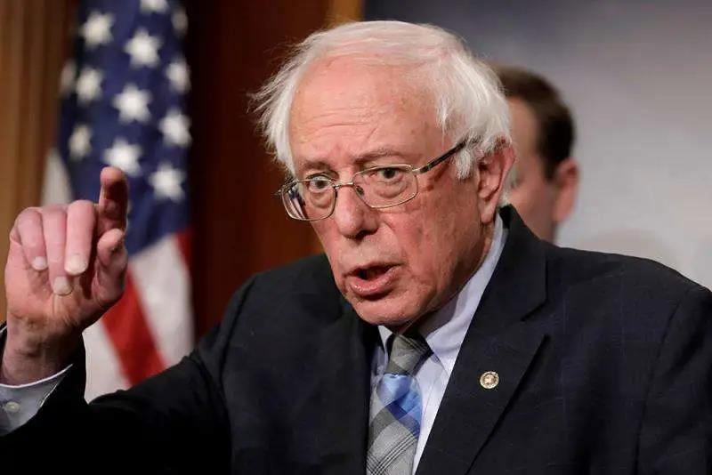

##正文

昨天的政事堂的微信，从早到晚都被谣言充斥着。

从早上全球最大的对冲基金水桥被造谣爆仓，到晚上桑德斯被造谣弃选，搞得我不胜其烦，不停的跟各路朋友辟谣。

说起来，这些谣言实在是假的不能再假了。

水桥是全球最大的对冲基金，他要是真的出现了系统性的爆仓，震荡相当于雷曼或者一个中等发达国家宣布破产，全球期货市场必然会瞬间砸出来一个坑，全球资本市场产生大量的联动效应。

资本主义如果这点效率都没有，早就被历史淘汰了。

同样，政事堂之前说过，桑德斯作为一个社会主义者，“竞选是宣言书，竞选是宣传队，竞选是播种机”，思想是目的，竞选只是手段。社会主义者会在看不到胜利之后，会选择保存力量，节约宝贵的经费，但不会放弃在全美散播其思想的机会。

社会主义如果连点理想都没有，也早就被历史淘汰了。

 

只不过，中国的媒体人们习惯了"开头一张图，内容全靠编"，也没有啥核实，就开始自发的制造和传播谣言.......

而谣言最可怕的地方，就是容易制造恐慌。

随着最近欧洲疫情纸里包不住火，大家会发现一个奇怪的数据，那就是德国和意大利的感染人数相差不大，但是死亡人数意大利却是德国的近百倍。

同样都是西方七国集团，同样都是老牌资本主义国家，做人的差距为什么那么大呢？

其实就是恐慌。

德国虽然有大量民众被感染，但是医疗系统没有被挤兑，秩序还在，床位和呼吸机都配给给了重症患者，因此病死率非常低，也就略高于普通流感。

但是，恐慌之下的意大利医疗系统被挤爆了，在争夺医疗争夺战中，大量的轻症患者占据了资源，使得很多弱势的重症患者就只能躺着等死，甚至其他病症的患者也受到了巨大的冲击。

如果政事堂没猜错的话，近期意大利因为医疗挤兑的死亡人数，有可能比疫情还要再多一个零。

这就是恐慌和挤兑的可怕之处。

而这也是日本和英国这些发达国家从政府和民众都在默默的极力遏制恐慌，因为他们非常清楚，恐慌带来的伤害远大于疫情。

而资本市场也是同理，疫情对全球生产和消费的冲击非常之大，全球各项经济参数都将面临大幅的下滑，各国股指作为经济的晴雨表，出现大幅下滑本就是意料。

于是，在所有人都知道未来要跌的情况下，很容易诱发挤兑式的逃离，巨大的恐慌会迅速传导至房地产市场等领域，引发全方面的践踏，导致很多美国企业和机构就像意大利那样，很多原本能康复的轻症患者，直接就被挤兑死了。

因此，资本主义的大本营美国从一开始的原则，就是在竭力控制恐慌。跟我们18年上半年一样，不断的做弹性防御，防止持续下跌成为市场的一致预期。

尤其是特朗普，大家可以回想一下我们18年上半年股市单边下行时政府承受的舆论压力，就知道大选年的特朗普有多焦躁了。

而看看正在进行权力更迭的沙特和正在进行修宪的俄罗斯，在国际油价撕成什么样子了，就会明白，如今特朗普现在正处于一个既疯狂咬人，又愿意舔人的”薛定谔的狗“的状态。

考虑到美国全球的医疗能力和产能爆发，疫情对生命造成重创的概率并不高。

所以，此时特朗普最需要的，还是资本市场。

而对他来说，最重要的就是两点，一个是遏制谣言，遏制恐慌，避免资本形成市场一致的践踏，另一个是甩锅，然后再以救世主的身份站出来重新将美国资本市场拉回来。

因此，可以预见的是，美股的弹性防御怎么也得再持续一个月，而这一个月的过程中，我们将承受特朗普巨大的压力，甚至各种奇形怪状的锅。

而在这个过程中，是我们相互对抗相互交易的关键时刻，舆论场上每赢得一个战役，外交援助上每多一个朋友，都将是跟特朗普交易过程中非常重要的筹码。

所以可以预见的是，我们接下来不仅要做好舆论工作，不背锅，不躺枪，不造谣，同时资本市场也要做好弹性防御。

##留言区
 

