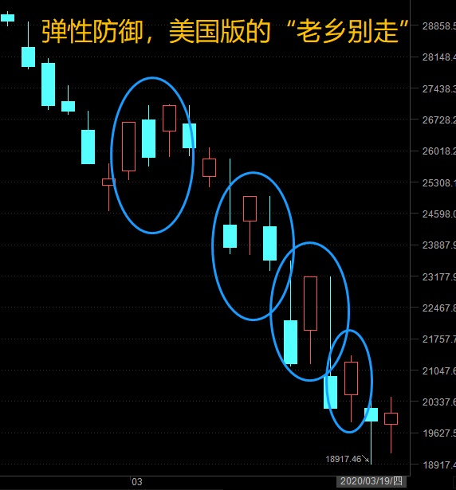
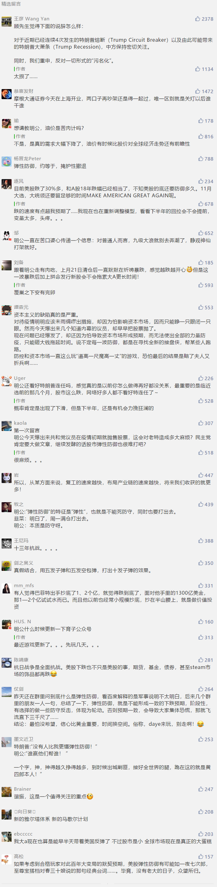

##正文

最近，很多读者在后台留言，询问政事堂之前预测的美股弹性防御究竟是什么，是不是可以抄底了.....

说起来，弹性防御这个词并不复杂，百度百科都有词条，只不过词条是从军事角度来解释罢了。

而经济角度的弹性防御，我记得在2017年底的卫国战争系列中表达过，后来在18年的股市中也用过多次。

这个词用在经济上的逻辑很简单，”弹性防御“的本质是”防御“，也就是说实力远不如对方。

从战略上不存在打赢对方的可能，因此只能选择以空间换时间，通过防御等待时机以出现外部的变化。

而”弹性防御“的特征是”弹性“，也就是不能死防守，同时也要打出去。

攻击的目的也不是为了胜利，是为了改变防御被动挨打的态势。

所以，当这个词被使用时，就不要寄希望于有什么牛市，就像抗日战争时期，你再怎么弹性防御，也不能反击到东京。

但是，弹性防御的大战略之下，有很多事情将会“必然发生”，这对很多人来说，是一种机会。

就像18年我们上半年“卫国战争初期”，跌两下就会被拉涨一波那样，美股目前也如预料般的出现了弹性防御的态势，只不过，震荡的频率和刺激程度，要高于两年前的我们。

 

如果从军事的角度，很容易理解这场金融战。

战术方面，以五次反围剿之前的红军为例，目标很明确，那就是主动出击打歼灭战，把各路诸侯组成的包围网给打散，让他们无法形成合力。

举一个比较形象的例子，就是如果你正在被一群人围着准备群殴，最好的方式是拼尽全力揪着先动手的人往死里打，让后面的人不敢往上。

而战略方面，以反法西斯战争的中国战场为例，目标也很明确，就是要破碎敌寇三个月灭亡中国的嚣张言论，防止市场形成一致的预期。

防止了预期，一方面使得中国国内不会大量涌现投降派的汪精卫，另一方面也让日本的文官、海军、舰队等各利益集团能够借机出手制约陆军。

因此，弹性防御的本质，就是要靠主动出击，防止形成一致的预期。以使得让我方力量形成合力的同时，分散对方的力量。

所以当年抗战刚开始，中国政府就连续组织了淞沪会战，台儿庄战役等主动出击的大型战役，甚至平型关一役，也获得了国共双方的共同大规模宣传。

毕竟，之前我们已经吃过一个大亏，东北军”不抵抗“撤出东北，瞬间让一片混乱的日本内部形成了中国弱鸡的一致预期，对华的鹰派就占据了上风。

嗯，我们再回到经济问题上，弹性防御最反面的例子，莫过于2016年的连续熔断，当时的监管几乎就是一战时的战术水平，通过设置熔断线，希望靠着无数道防线，能够阶梯式的抵御住股市的下跌。

可是，连续的向下熔断反而造成了一致向下的预期，导致所有的机构都得出早抛早止损的结论，纷纷加入到抛售行列，反而引发了恐慌式的挤兑。

而看看特朗普的资本市场，操作还是非常靠谱的，就算史无前例的四次熔断，让巴菲特都成为了笑料，特朗普团队也从来没有搞出来连续熔断，每次暴跌熔断之后必然有暴涨，人为的制造出来预期的不一致。

否则，原本蛰伏的空头们纷纷搞起了联合舰队，而多头的韭菜们纷纷倒戈成为了汪精卫，那么就是神仙也难救的。

所以，某种程度上说，这种美股弹性防御期间反弹赚的政策钱，也都是一种特朗普给的酬劳，因为这种激烈的反弹，使得原本应改一边倒的下跌被遏制住了。

这让美股虽然半个月就跌没了三分之一，远比08年跌的要快，但是却没有造成08年的挤兑潮。

但是说了这么多，还是要回归到弹性防御的本质上，不能因为打了几个台儿庄大胜，就忘记了弹性的本质还是在防守。

在没有外力的支撑下，美股接下来的趋势，不过是弹到武汉，还是弹到重庆的区别。

如果不动脑子一头扎进去，很容易被埋了，就像抗战刚开始，谁也没想到会打八年。

而且，历史上所的弹性防御，必然都是精锐部队打出来的，没有那个金刚钻，也别去揽瓷器活。

而更重要的是，全球资本市场在美股的带动下，谁也无法独善其身。

这时候，大家手拉手，全球按照同一个节奏打弹性防御，全球股市的谐振也会越来越显著。

其中，自然也会包括我们。

而此时，知道战争还远没有结束的我们，要做的，就是学习一战二战时的美国，利用被战争隔绝的优势，重塑冲击后的全球产业链。

##留言区
 

