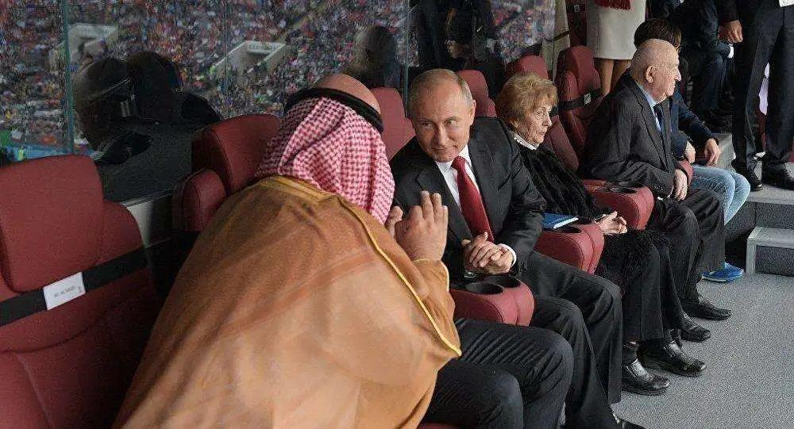

##正文

就在国际油价跌跌不休之际，特朗普终于出手了，昨天在白宫宣布，自己正在制定计划，在适当的时候参与到沙特与俄罗斯的石油价格战。

随后《华尔街日报》援引消息人士的话称，华盛顿准备分别利用外交手段和制裁威胁要求利雅得和莫斯科减少石油生产。

受此消息影响，国际油价在连跌三日之后出现暴涨，创下了自WTI期货合约创始以来的最大单日涨幅，收复了本周三“史上第三大单日跌幅”的失地。

让全球的石油大佬们也深刻体验了一回什么叫做“一顿操作猛如虎，涨跌全看特朗普”，俄罗斯方面更是表示美国对俄罗斯的施压可能“引爆整个世界”。

但实际上，很多人都低估了特朗普的操作。

在很多专业人士眼中，国际油价是沙特、俄罗斯和美国页岩油的“三国杀”，这的确是一个长期的博弈，但是，很多人并没有考虑到短期油价背后，也有着美俄沙三国领导人之间的交易。

而三位领导人，各自都有着一笔只能赢不能输的交易。

沙特国王萨勒曼本月刚刚囚禁了“皇太弟”艾哈迈德亲王及前王储纳伊夫，为其子小萨勒曼的接班布局马上就要走到最后的一步。

俄罗斯总统普京将于下个月将要对俄罗斯宪法进行修订，其中最受人关注的，就是对普京总统之前的任期进行“清零”。

至于特朗普就更不用说了，全世界都知道他今年要为了连任总统进行一场只能赢不能输的世纪选举。

于是，此刻对民意和经济都非常依赖的三位大佬，都遭受到了股市和油市的重创，成为了妥妥的“难兄难弟”。

按理说，随着疫情全球蔓延，需求必然大幅下滑，在这个零和博弈之下，经济学家的严重，三国只可能相互拆台。

但是，他们却往往忽略了美俄沙三国最高领导人之间巨大的相互依赖。

沙特萨勒曼家族想要实现家族的传承，遏制其他五千多个王爷们的野心，就需要在中东有着巨大影响力的美俄两国承诺和保护。就像前年沙特记者谋杀案之类的事件小萨勒曼几乎被全球舆论封杀，但是在特朗普和普京的帮助下，王储顺利解套重回国际中心。

普京能够解除亲西方的梅德韦杰夫之总理职务，从二人转改为独角戏，政治上靠的是特朗普上台后美国不再扶持俄罗斯、乌克兰等国内部的亲西方派，经济上靠的是跟萨勒曼家族的配合，在OPEC+上面一起限产和稳定中东局势，让全球能源价格一路走高。

至于特朗普就更不用说了，四年前的美国大选，全球所有的政治力量全部都在压住希拉里，只有萨勒曼和普京等少数实力压住了特朗普，选择在背后全力支持，如此巨大而无条件的投入，使得特朗普在今年的大选问题上，如果说有谁是绝对不会背叛他的，萨勒曼和普京肯定包揽前两名。

 

所以，三方之间的秘密勾兑，是必然的.

三方若是打起来，就跟当年北洋军阀之间的大战，都是雷声大雨点小，打给别人看的。

而如今，特朗普同时威胁制裁美俄的动作，其实不难理解，那就是要把能源市场跟自己挂钩以获取筹码。

决定明年总统归属最重要的两个摇摆州，德克萨斯和佛罗里达，都是近年来的页岩油大洲，从采油炼油运输管网乃至融资和金融衍生品，两个州老百姓的富裕都与页岩油有着直接的关系。

因此特朗普想要获取这两个州的民心和大佬们的支持，最好的方法不是锦上添花，而是雪中送炭，在巨额负债的页岩油体系濒临崩溃之际出手相助，挽狂澜于既倒，那么才能在非常被动的局面下实施绝地反击。

所以，不要觉得特朗普在痴人说梦，他今年的动作主旨，就是在加强美国民众和市场对俄罗斯沙特的政策变化，与自己的动作的关联性预期。

这需要沙特跟俄罗斯的密切配合，造成每一次沙特跟俄罗斯的谈判取得进展，都是在特朗普干涉和压力之下达成的。

此时正处于关键时刻的萨勒曼和普京，同样也需要特朗普的配合，三个玩家好能一致的把戏演下去，“一油三表”这种事儿对于他们来说都不是啥难事儿。

举个例子，就像政事堂之前预测的，不用等下一次OPEC+，俄罗斯修订宪法之前，沙特就会先“屈服”一下，作为给新沙皇加冕的订金。

而可以预见嗯但是，特朗普同时必然也会把这个功劳挂在自己的身上，说是自己对沙特的施压取得了巨大的成功。

慢慢的，几次下来，一个市场化的行为，就会变成政策性的行为，提前知道交易细节的王爷和亲随们，都会赚得盆满钵满，作为他们支持三位大佬的报酬

而对于民众来说，接下来还有大半年，每次上涨都靠特朗普，在这种不断强化的训练之下，德克萨斯和佛罗里达的选民就会成为“巴普洛夫的狗”，把特朗普视为唯一能够挽救油价和庞大页岩油就业和债务的救世主。

这意味着就算石油市场依旧熊市，他们还是会把选票投给能够驯化沙特和俄罗斯的特朗普。

只能说这也是没办法的办法，就像当年老蒋抗战输的一塌糊涂，但是靠着美国人和苏联人返回南京后，还是受到了民众的夹道欢迎和全国的空前支持，民众都是由一个个人组成的，大家玩的也是大众心理学。

好了，说完了油价，再来说一下股市。对于特朗普来说，股指跟油指一样，都是无解的，年底之前是不可能拉回到年初的水平，特朗普只能想办法“丧市喜办”。

所以，对于特朗普近期的甩锅行为，我们也要一分为二的来看，股市特朗普市肯定不能复原的，但是，每一次的拉涨，特朗普都需要把这些变成他的功绩，随着美国财政政策和货币政策的逐步用尽，特朗普唯一能指望的，实际上还是海外的援军。

未来，特朗普必然要把请援军的功劳都算在自己的头上，所以现在，他也会提前在舆论场上开始大规模的“极限施压”。

这意味着我们必然会反击，但是反击也必然会适度。

而真正需要考虑的是，是否选择跟俄罗斯和沙特一样，把对这笔大交易坚持到底。

##留言区
 

