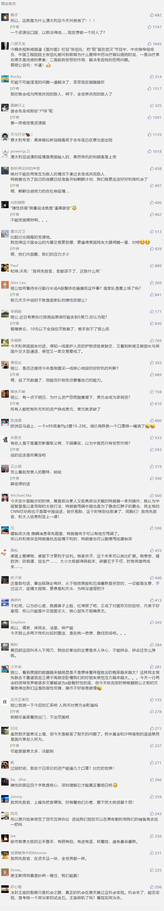

##正文

近日，美国全国公共广播电台曝光了一段秘密录音。

录音显示，在2月27日，美国参议院情报委员会主席伯尔，在“国会山俱乐部”午餐会上，跟他的“金主爸爸”们表示，新冠肺炎疫情将会像“1918年大流感”一样扩散开来，让他们做好准备。
。

 

很快，另一家亲民主党的媒体纽约时报就跟着补刀，早在2月13日，这位情报大佬就抛售了上百万美元的股票，成功在道琼斯有史以来的最高点成功逃顶。

要知道，情报委员会和军事委员会是在掌管着美国外交力量的参议院中，是权力最大的两个机构，这俩委员会一勾兑，萨达姆卡扎菲之流的命可就没了。

而值得关注的是，近日来被爆出来的也不止伯尔一人，从军事委员主席英霍夫，到情报委员会副主席范斯坦，这些掌管着美国最高情报的大佬们，纷纷在最高点大规模抛售手中的股票。

这很容易让人联想到，美国最近俩月的恐慌式暴跌的背后，都是一些从情报界和军界拿到信息的大金主们在疯狂跑路抛售资产，而与此同时，美国高层却在蒙蔽抚慰民众，好让“领导们先走”。

而比较能佐证这点的，则是最近一个月来美元指数一骑绝尘，与之前2001年911，2008年金融风暴以及2018年贸易摩擦时，美元指数下跌相反，此次美元碾压了日元、瑞士法郎以及黄金等所有的传统避险货币。

尤其是黄金在疫情期间的不疯涨，让很多投资黄金的人都普遍一脸懵逼。

逻辑其实不复杂，由于提前拿到了情报，目前市场上最大的资本，寻求的不是避险，而是在不计代价抛售资产。

而由于这些资产都是美国大佬们的，都是以美元计价的，所以才会造成了跟以往相反的情况，在资产的挤兑潮之下，市场上匮乏的美元反而成为了紧俏物。

而这也能将之前美联储的超预期降息和降息后依然暴跌的逻辑给说通了。

一方面，美联储出台了远超市场预期的放水动作，是因为手握充足情报的美联储大佬们经过计算，发现市面上的美元根本不足以支撑大规模资产的抛售，因此只能打出以往数倍的弹药。

另一方面，美联储超预期的弹药仍然扛不住美股的狂泄，跟段子手们编的“下跪”段子没啥关系，是因为美国大佬们恐慌式抛售的资产实在是太多了，释放的货币根本承接不住。

换个角度来说，就是美联储“救民先救官”，先掩盖消息，用美国人民的财富把手握大量资产大佬们给救活了，然后再考虑怎么救美国人民。

而美国人民归根结底还是要救的，但不可能用美国大佬们的钱，因此就只能想办法全球搜刮了。

现在危险的，就是全球那些背负着美元债务的逆差国们。

一方面，过度依赖资源出口和第三产业，在疫情冲击需求之下很容易瘫痪，另一方面，美元涨价汇率贬值导致进口和偿债成本激增，如果借不到美元就可能引发挤兑和经济崩溃。

所以，降息放水是一把双刃剑，除了美国之外，决策时都会很慎重，因为货币发的越多，汇率就跌的越惨，如果拿不到美国的援助，反而会诱发美元资本的逃离，导致股汇双杀。

这也是为什么中国央行在3月全球降息潮之下，顶着国内那些所谓的专家们的鼓噪，MLF和lpr都没有下调的原因之一。

作为美国资产重仓的中国，我们不仅要防止股市的暴跌引发恐慌，也要避免汇率的波动引发美资在美国那种恐慌式的大甩卖。

所以，前些天那些制造谣言说重仓中国的桥水基金爆仓的人，有可能也是用心不良。

而相比于中国这样有制造业，有市场的国家，那些国内存在短腿的国家目前都慌得一比，随着几个主要大国开始封锁和战略储备，原材料和制成品之间会出现巨大的剪刀差。

就像沙特的高质量原油已经跌成狗了，但是把原油炼化后做成的口罩和防护服却可以卖上天价。

所以，尽快安全复工才是关键。

目前，全球经济的衰退已经无法避免，短期内，牌桌上的各个国家从防疫到经济，也都先后陷入到了囚徒博弈与负和博弈，不要指望G7或者G20能够出台什么利好的措施，大家都在避免自己成为这一场博弈中的牺牲品的同时，也在等着如何去分尸他人。

尤其是那些能够从军界和情报界提前拿到消息，在美股最高点全身而退的大佬们，手里握着特朗普三年景气期间累积的巨额财富，宛如秃鹫一般等待着危机之下遍地廉价的筹码。

而再看看最近全面收缩的美军，竟然顶着疫情又来南海搞自由行情，除了特朗普之外，恐怕也跟那些与参议院军界和情报界有着密切关系的大金主们有着一些联系。

所以呢，别人越着急，我们就应该越慢，慢慢稳住股市和汇市，也稳住地缘和能源贸易，这样才能卖出一个好加码，反正未来那些手握巨额美元的大佬们，钱没地方投了，最后还是得找我们来给他们续一把。

 

因此，面对压力，我们不能躲，但也不能硬刚，而应该用我们祖上传下来的太极，把力量都给他们推回去，让已经全面开撕的共和党和民主党自己先窝里斗。

还是那句话，他强由他强，清风拂山岗，他横由他横，明月照大江。

##留言区
 

