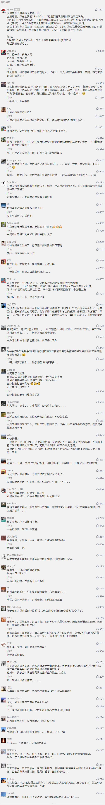

##正文

昨夜，美联储召开紧急会议，祭出了一个大杀器，将不设上限的购买美国国债和抵押贷款，被市场誉为“无上限量化宽松”。

随着美联储替特朗普打了一场弹性防御，美股带着全球资本市场又坐了一次惊悚的过山车。

很多支持奥派的朋友们感觉信仰都快崩塌了，独立自主的美联储仿佛段誉在无量山疯狂磕头一般，对特朗普的放水那叫一个言听计从。

而财经媒体朋友们也挺崩溃的，几天前因为美联储将“利率降至零”，纷纷表示美联储已经把所有弹药都打出去了，可结果没想到美联储竟然这么没有节操和下限。

当然，这种没节操的事情，随着股市的进一步重创，美联储只会不断调整自己的“下限”，放水就像作弊的六脉神剑突突突那样，没有鲍威尔做不到的，只有大家想不到的。

道理很简单，韭菜是没有记忆的，而收割机却是有记忆的。

2008年的金融风暴，当时也正值美国大选，共和党的麦凯恩对阵民主党的奥巴马，上半年的时候，没有多少人相信有谁可以战胜声望如日中天的麦凯恩，当年小布什都慨叹，这哥们强大到成为独立于两党之外的第三股力量。

 

但是，随着雷曼兄弟的垮台，美国从美联储到财政部，从华尔街到国会山，在救助的问题上各股力量相互扯皮，导致没有及时的向市场注入流动性，引发了全球资本市场海啸。

而在美国国内，股市和房地产市场的暴跌，使得民众把股市下跌、抵押房产被收回引起的愤恨，都一股脑的记在了共和党的身上。

超级黑马奥巴马，不仅以349比163狂扫麦凯恩，参众两院也全部被民主党扫货，形成了民主党在美国“大一统”的局面。

而奥巴马又不是克林顿和布什家族那样的传统建制派总统，他做起事情来比较有自己的主见，从缩减军费，到开发页岩油，从新能源补贴，再到奥巴马医保，缺乏制约的民主党顺利推动了一系列共和党深恶痛绝的议案。

因此，民主党的赢者通吃，既是特朗普能够上台的主要原因之一，也是特朗普上台后把奥巴马的改革统统改回去，以兑现他的竞选承诺。

看看奥巴马和特朗普，正面和反面的例子都有了，在弹劾问题上空前一致的共和党上下很清楚，如果让民主党再一次借用经济危机来复制2008年时的大胜，那么共和党将再一次体会什么叫做一朝回到解放前。

所以，共和党力量占据主导的美联储，在援助的问题上毫不犹豫，有弹药就打弹药，没有弹药就制造弹药，最根本的还是要守住自身的利益，不管他们是否喜欢特朗普，在防止爆发经济危机的问题上，从经济到政治，各方利益是一致的。

因此今年美国的资本市场只会出现不断的救援计划，不断的弹性防御，而很难出现08年豫湘桂大溃败式的连锁践踏反应。

但是，这种放水的弹性防御，意味着美国将这次危机人为的拉长，虽然大幅提升了自身的安全系数，但是时间一长，有些之前不为人知的黑天鹅，就会纷纷浮出水面。

而另一方面，美国自己不去承担危机，也就意味着这一轮大量的新兴国家将会遭受到远比08年严重的重创。

所以，全球抄底的朋友，请慎重。

那么，全球复苏的拐点什么时候会出现呢？

同样，还是要从12年前去寻找答案。

2008年11月5日，国务院常务会议确定了当前进一步扩大内需、促进经济增长的十项措施，后世将其归纳总结为“四万亿”。

这个时间点其实很值得玩味。

四年一次的美国大选，投票日是11月的第一个周二，在2008年，也就是11月4日......

这也许是巧合，也许是中国中庸之道的智慧，在遇到需要站队的问题上，中国人往往“谁赢我们帮谁”，不会过早的打出这场刺激经济的Red Card，而把他作为我们的贺礼。
 
 

所以，这一轮拐点大概的时间，其实是可以估算出来的，如果我们提前出牌了，也许意味着全球正在进行一场超级大交易。

##留言区
 

