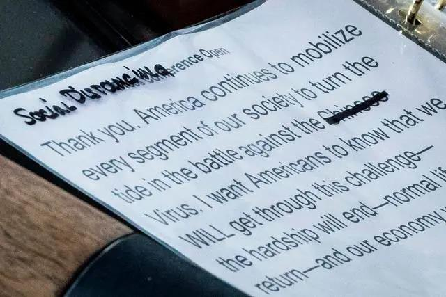
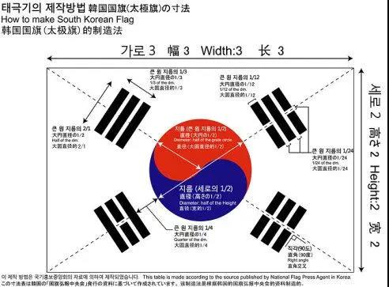
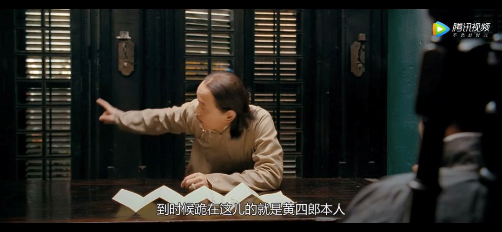

##正文

昨天深夜，特朗普在接受福克斯新闻采访时表示，他决定不再称新冠病毒为“中国病毒”。

 

在随后的记者会上，他还手动将“中国病毒”的内容删掉了，甚至加入了一段“维护亚裔美国人”的内容。

 

要知道就在三天前，白宫还启动了一项"公关计划"，要求官员们集中指责北京"试图掩盖疫情"并造成全球大流行。

一时之间，中美之间发生了什么，成为了无数人心目中的疑问。

其实，这事儿没那么复杂，就像特朗普刚开始搞污名化的时候，政事堂就说了，这位交易高手又开始在交易前搞限施压了。

特朗普压，我们就抻，抻到时间节点，自然就不施压了。

而昨天特朗普的改弦易辙，还真不是因为大家达成了什么交易，而这个博弈的时间节点，就是明天，特朗普选择在最后一刻停止了极限施压。

3月26日，全球主要经济体就将召开G20领导人特别的电话峰会。

这个会议对于特朗普来说特别重要，因为之前刚刚开过的G7峰会上，西方发达国家之间搞得不欢而散，没有拿出能够一致对抗疫情和提振经济的动作，也诱发了近期全球资本市场的震荡下跌。

而今年就要面临大选的特朗普，必须要把疫情和经济在今年解决，因此，囊括了几乎全球主要经济体，拥有一大堆老朋友的G20，将是特朗普翻盘的决战主战场。

甚至今天特朗普还先后给安倍和文在寅去了电话。

所以呢，这两天的全球资本市场的回暖背后，不是因为美联储的决堤花园口，而是跟特朗普一样，都对这一场寡头会议抱以厚望。

既然欧美主导的西方七国集团无法达成一致，那么这一轮二十国集团的重点必然是在亚洲，希望是中日韩这三个全球经济不熄火的发动机。

而这也是为啥政事堂在特朗普搞污名化之前，就如祥林嫂一般的劝说国内的媒体们别往自己身上揽责任和瞎吹哨，因为我们脑子里面进的水，都会成为未来眼中流下的泪。

这不，今天境外媒体就开始纷纷炒作中国要降息了......

政事堂的读者们跟着我看了这么多年，都会明白，我们一旦提前开始大防水，那么就会为山九仞功亏一篑，这么多年的努力就将付诸流水。

所以，我们必须抻。

同样，为了连任的特朗普也必须压。

这都是大家的必然选择，谁也不用怪谁。

因此，在确定了20会谈的日期后，擅长交易的特朗普这几天的时间里打出了一套密集的组合。给朝鲜写了一封亲笔信，对韩国军费又突然狮子大开口，对中国搞出来了病毒的污名化，甚至还一边鼓动五眼联盟的盟友纷纷声明退奥运，一边公开表示自己是否参加奥运会这事儿全听安倍的......

本质，都是在试图给自己争取谈判和勒索的筹码。

而中日韩三国对特朗普的回应，则都充满了本国特色。

以柔克刚的太极虎，在军费问题只退一小步，但是承诺对美国提供抗疫的医疗设备的援助。

 

刚猛果断的武士道，断然在峰会前宣布将奥运延期至明年。

 

中庸之道的师爷们，则是在舆论场上一边打一边谈，搞摸棱两可和“薛定谔”，一直抻到了G20会谈，逼着特朗普自己先改口。
 
 

 

而从今天特朗普安倍和文在寅哥俩公布的通话内容来看，黄老爷大概率还真就是“跪”了，并没有从东亚三雄手中拿到自己想要的东西，而不得不在会面前终止施压。

美国的大选在今年，且不说股市和经济了，美国的感染人数也将远超中日韩，时间是站在我们这边的，特朗普的腾挪空间并不大。

尤其是这一波污名化，导致了亚裔选民怒火冲天，必然会导致这批对投票没有兴趣的选民去强烈支持民主党。

所以，才出现了特朗普昨夜临时对演讲稿做出了修改，赶在G20通话前，一方面尽快修复跟亚裔选民的关系，另一方面向东亚国家们释放善意的信号，而不是像之前搞出来所谓的“第一阶段”。

东亚国家一个个都猴精的，不见兔子不撒鹰，特朗普不拿出来足够的筹码，靠他自己创了个名词就想卖出天价，不啻于天方夜谭，因此政事堂对此次G20峰会只能保持谨慎乐观，不大可能出现一揽子的经济振兴方案。

当然，大家也不会让特朗普太难堪，交易还要继续，总要让他拿回去一些东西的，也必须要比G7取得更好的成果。

因此除去明面上的一些政治正确的口号之外，亚洲国家们也会给一些实质性的帮助，譬如帮助特朗普的盟友沙特小幅弹性防御一下，来换点长期的合同。

而想要真正的交易，就得有“崽卖爷田”的态度，拿出点非卖品和真东西。

##留言区
 

