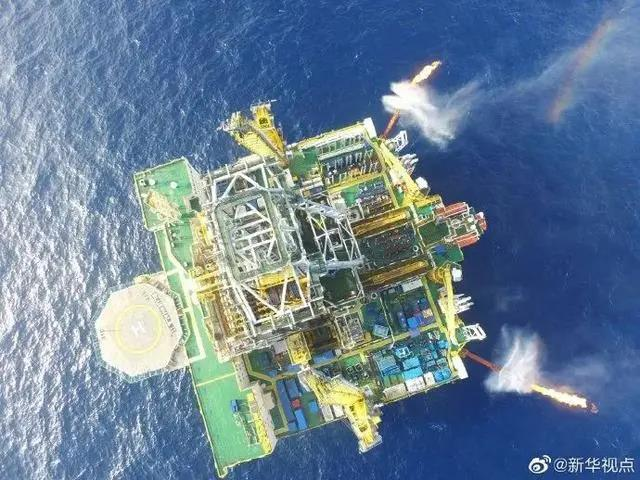
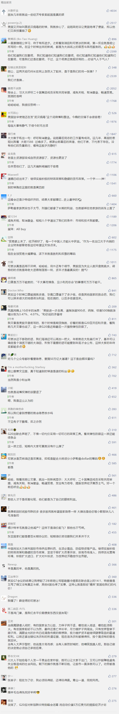

##正文

今天凌晨历上最昂贵的经济刺激法案出炉，“2万亿美元”计划被美国参议院以全票通过。

不出意外，这份议案将在本周五于众议院以语音表决的方式推动通过，并立即被特朗普签署生效。

不过，这份空前的经济刺激计划并没有获得预期的结果，美股期货盘前纷纷由升转跌，远没有前一天G7财长会议对股市的提振效果强劲。

原因很简单，美国无论没有投入多少的经济刺激，迟早都是要连本带息偿还的，并不会搞出什么增量来，真正能够起决定性的，是今晚的G20特别会议。

而美国、G7以及G20三者之间，经济刺激计划的关系，用一段经典台词可以刻画的淋漓尽致，那就是：县长（美国）上任，得巧立名目，拉拢豪绅（G7），缴税捐款，他们（G7）交了，才能让百姓（G20）跟着交钱。

 

美国和欧盟领头羊的德国几乎同时在G20之前强势通过了史无前例的经济刺激计划，一个主要原因，就是要逼着其他的G20国家，也跟着一起开启史无前例的放水以拯救全球经济。

 

因越是在全球经济中占据主导地位，拥有全球产业链和铸币权的美国和德国这类国家，越是希望大家一起刺激经济和放水，而且还越喜欢把经济刺激的调门抬高。

毕竟，对于这种大佬们来说，出的越多，挣得越多。

 

因为经济危机当中，全球的主要经济体都急需美元和欧元这些外汇储备，尤其是当他们开启经济刺激计划的时候，就更需要大量的外储来稳定汇率和通货膨胀。

因此，G20国家们一旦提前开启经济刺激计划，而没有捞到足够的交易筹码，放水的同时就会让美元成为悬在自己头上的达摩克利斯之剑，稍有不慎就会导致日本广场协定的前车之鉴。

明明吃了一碗粉，却得在华府大管家和团练教头的威逼下，在吃瓜群众们的围观下，去付两碗的钱。

没钱咋办？那就只能在武士道精神下去切腹，失去30年后再是一条好汉。

 

而昨天的七国集团外长会议上，华府大管家蓬佩奥要求将“武汉病毒”写入公报中，本质也是要拉拢豪绅，来污蔑我们吃了两碗粉，好在今晚的G20上对我们集体施压，以迫使我们也学日本搞一次切腹。

 

只是国内那些只知道去承认错误，主动给自己泼脏水的媒体人，他们不知道我们国际博弈当中，每被对手抓住一个错误，都需要让每个中国人都需要承担的巨大代价。

而那些海外施压的压力还没传导过来，就集体先跪了，纷纷跳出来主张降息放水的经济专家们，更是让我们没拿到筹码就提前丢王炸。

不得不说，国内所谓的精英阶层的的低智化到了这个程度，这也是国人的一种悲哀。

那么，什么是应该做的？

还记得两天前给法国和德国的那两通电话么？还记得给意大利捐赠的物资和派遣的医疗队么？还记得我们约定的今年访日与产业合作么？还记得我们源源不断的物资飞往全球各地么？

这些外交上的觥筹交错，背后都是刀光剑影，而这些动作背后的默默努力，才是真正的英雄。

正是在这一系列的合纵连横之下，昨天国际社会热切期盼的G7外长会，否决了蓬佩奥的“武汉病毒”而没有如预期般的发布联合公告，甚至德法会后还发布了联合声明，强调国际社会应团结合作共同抗击疫情。

显然这是帮我们在怼蓬佩奥这个华府大管家，不让我们成为众矢之的。

 

可以说，正是在我们外交和舆论战线上同志们的努力，今晚的G20上面我们不会成为众矢之的和案板上的羊羔。

而既然躲过了这一记暗枪，那么本着“只要你一枪打不死我，我们还可以做交易，只要价格合适”的国际通行原则，如今，我们也可以跟美国谈一谈其他的拯救经济之路，在逐步掌握主动权之后，我们也会谈一谈譬如取消贸易壁垒推动自由贸易之类的话题。

这样，贸易额上来了，经济转好了，每一个中国人才能从中获益。

 

最后，还记得昨晚文章政事堂预测的“帮助特朗普的盟友沙特小幅弹性防御一下，来换点长期的合同”吗？

今天一早就蹦出来俩新闻，一个是蓬佩奥连夜给小萨勒曼去电话，要求沙特安抚全球能源与金融市场，另一个是继渤海发现大油田后，国土资源部今早宣布，中国南海发现了总量和日产量创世界纪录的“可燃冰”，技术也实现了标志性的跨越。

 

很显然，意识到无法从东亚国家身上薅羊毛的美国人，还是得找羊来薅的。

不出意外，此次G20也不用操之过急，以避免扯到蛋，大家可以在能源方面，先拿出来一个说得过去的合作。

譬如，咱们先分一下萨勒曼家族的那点Dollar。

 

##留言区
 

